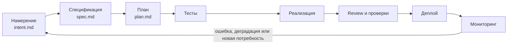

# AI-native SDLC — методичка Claude Code

> [!abstract] Назначение
> Практическая методичка по организации полного цикла разработки с AI-агентом: от формулировки намерения до эксплуатации и возврата производственных сигналов в новый цикл разработки.

- **Источник видео:** [Eric Tech — Claude Code: The Complete AI-Native SDLC Guide](https://youtu.be/6CaQ9ZFuuKI)
- **Длительность:** 21:02
- **Первоисточник методики:** [The AI-native SDLC playbook — Claude Academy](https://academy.claude.com/courses/ai-native-sdlc-playbook/introduction)

> [!note] Как подготовлен материал
> Методичка составлена по полному автоматическому транскрипту видео и сверена с вводной частью официального playbook. Рекламные вставки из ролика исключены, ошибки автоматического распознавания терминов исправлены.

## Результат применения

После внедрения процесса в репозитории появляется проверяемая цепочка артефактов:

```text
intent.md → spec.md → plan.md → тесты → код → review.md / PR
          → CI/CD → мониторинг → incident.md → новый intent.md
```

Каждый этап:

1. читает зафиксированный результат предыдущего этапа;
2. создаёт собственный артефакт;
3. завершается проверяемым контрольным условием;
4. требует участия человека там, где необходимо решение, а не механическое выполнение.

## Главная идея

В традиционном SDLC основной объём времени занимало написание кода. AI-агент резко ускоряет реализацию, поэтому узкие места смещаются в три зоны:

- формулирование требований;
- проверка и управление качеством;
- безопасный выпуск изменений.

AI-native SDLC не означает «отдать агенту всё». Он переносит человеческое внимание с ручного выполнения на постановку намерения, подтверждение важных решений и контроль границ риска.



## Роли

| Роль | Ответственность |
|---|---|
| Владелец продукта | Определяет проблему, ожидаемый результат и приоритет |
| Разработчик | Утверждает технические решения и отвечает за итоговое изменение |
| AI-агент | Уточняет контекст, создаёт артефакты, реализует и проверяет изменения |
| Reviewer | Ищет дефекты, риски и расхождения со спецификацией |
| CI/CD | Автоматически применяет воспроизводимые проверки и политики |
| Наблюдаемость | Возвращает факты о поведении системы после выпуска |

Один человек может совмещать несколько ролей, но их обязанности должны оставаться разделёнными.

## Рекомендуемая структура репозитория

```text
project/
├── CLAUDE.md
├── intents/
│   └── FEATURE-001.md
├── specs/
│   └── FEATURE-001.md
├── plans/
│   └── FEATURE-001.md
├── reviews/
│   └── FEATURE-001.md
├── incidents/
│   └── INC-001.md
├── evals/
│   ├── cases/
│   └── README.md
├── .claude/
│   ├── skills/
│   └── hooks/
└── .github/workflows/
```

Названия папок не обязательны. Важно, чтобы источники истины были однозначны, версионировались и связывались общим идентификатором изменения.

---

## Этап 1. Зафиксировать намерение

**Таймкод видео:** [01:44](https://youtu.be/6CaQ9ZFuuKI?t=104)

### Цель

Понять, зачем требуется изменение, кому оно нужно и какой результат будет считаться ценным. AI-агент здесь работает как интервьюер: задаёт уточняющие вопросы и проходит по ветвям решений до общего понимания задачи.

### Что выяснить

- какая проблема наблюдается сейчас;
- кто затронут;
- какой результат нужен;
- что сознательно не входит в задачу;
- какие есть ограничения и риски;
- какие вопросы пока не закрыты;
- по каким признакам владелец продукта примет результат.

### Шаблон `intent.md`

```md
# INTENT: <краткое название>

## Проблема
Что происходит сейчас и почему это важно?

## Желаемый результат
Что должно измениться для пользователя или бизнеса?

## Затронутые пользователи
Кто получает пользу и кто может столкнуться с изменением?

## В рамках задачи
- ...

## Вне рамок задачи
- ...

## Ограничения
- технические;
- бизнесовые;
- сроки;
- безопасность и соответствие требованиям.

## Критерии приёмки
- [ ] ...

## Открытые вопросы
- ...
```

`intent.md` можно хранить в Git, Jira, Linear или другой системе задач. Условие одно: это должен быть единый читаемый человеком и агентом источник истины.

### Контрольная точка

- проблема описана без преждевременного навязывания решения;
- критерии приёмки проверяемы;
- открытые вопросы либо закрыты, либо явно отмечены;
- человек подтвердил намерение.

---

## Этап 2. Преобразовать намерение в спецификацию

**Таймкод видео:** [04:10](https://youtu.be/6CaQ9ZFuuKI?t=250)

### Разница между артефактами

- `intent.md` объясняет **зачем** выполняется изменение;
- `spec.md` определяет **что именно** должна делать система;
- `plan.md` фиксирует **как и в каком порядке** это будет реализовано.

### Шаблон `spec.md`

```md
# SPEC: <идентификатор и название>

## Контекст
Ссылка на соответствующий intent.

## Функциональные требования
1. Система должна ...

## Нефункциональные требования
- производительность;
- надёжность;
- безопасность;
- доступность;
- наблюдаемость.

## Интерфейсы и контракты
- API;
- события;
- модели данных;
- пользовательские сценарии.

## Граничные случаи и ошибки
- ...

## Миграции и совместимость
- ...

## Критерии приёмки
- [ ] Given / When / Then ...

## Неопределённости
- ...
```

### Контрольная точка

- каждый критерий намерения отражён в спецификации;
- поведение системы описано наблюдаемыми результатами;
- явно указаны ошибки, границы и требования безопасности;
- в спецификации нет скрытых продуктовых решений.

---

## Этап 3. Создать исполнимый план

**Таймкод видео:** [06:05](https://youtu.be/6CaQ9ZFuuKI?t=365)

План должен быть достаточно конкретным, чтобы другой агент или разработчик мог выполнить его без повторного исследования всей кодовой базы.

### Шаблон `plan.md`

```md
# PLAN: <идентификатор и название>

## Связанные артефакты
- Intent: ...
- Spec: ...

## Затрагиваемые файлы и компоненты
| Путь | Изменение | Причина |
|---|---|---|
| `...` | создать / изменить / удалить | ... |

## Порядок работы
- [ ] 1. Написать или обновить тест ...
- [ ] 2. Реализовать минимальное изменение ...
- [ ] 3. Выполнить миграцию ...
- [ ] 4. Обновить документацию ...

## Зависимости и параллельная работа
- ...

## Риски и способы снижения
- ...

## Проверка завершения
- команда тестов;
- линтер и проверка типов;
- сборка;
- ручной сценарий или скриншот;
- проверка наблюдаемости.
```

### Требования к задачам

Каждый пункт плана должен иметь:

- однозначный результат;
- ожидаемые файлы или интерфейсы;
- зависимость от других пунктов;
- способ проверки;
- разумный размер для одного рабочего шага.

### Контрольная точка

- план покрывает всю спецификацию;
- для каждого изменения указан способ проверки;
- рисковые действия выделены отдельно;
- порядок допускает откат и промежуточные коммиты.

---

## Этап 4. Реализовать через проверяемый цикл

**Таймкод видео:** [08:53](https://youtu.be/6CaQ9ZFuuKI?t=533)

Основной принцип: агент не должен объявлять задачу выполненной, пока не получил объективную обратную связь о своей работе.

### Цикл TDD

```text
красный тест → минимальная реализация → зелёный тест → рефакторинг
```

Для каждого пункта плана:

1. Написать тест, отражающий требование.
2. Убедиться, что тест падает по ожидаемой причине.
3. Внести минимальное изменение кода.
4. Запустить релевантные тесты.
5. Провести рефакторинг без изменения поведения.
6. Запустить полный набор обязательных проверок.
7. Отметить пункт плана завершённым и записать доказательство.

### Минимальный verification loop

```text
tests → lint/typecheck → build → runtime check
```

> [!warning] Правило завершения
> Нельзя сообщать «готово», если тесты, статические проверки или сборка красные. Если проверка недоступна, это нужно явно зафиксировать как непроверенный риск.

---

## Этап 5. Построить слои тестирования

**Таймкод видео:** [12:15](https://youtu.be/6CaQ9ZFuuKI?t=735)

| Слой | Что проверяет | Примеры инструментов |
|---|---|---|
| Функциональный / unit | Функции, вычисления, сервисы и отдельные контракты | Jest, Vitest, Pytest |
| Компонентный | UI-компоненты, формы, состояния и взаимодействия | React Testing Library |
| End-to-end | Полный пользовательский маршрут через несколько компонентов и страниц | Playwright, Cypress |

### Правила набора тестов

- нижние слои должны быть быстрыми и многочисленными;
- end-to-end тесты покрывают критические пользовательские пути, а не каждую деталь;
- ошибки должны проверяться так же явно, как успешные сценарии;
- тесты обязаны быть воспроизводимыми в CI;
- нестабильный тест считается дефектом тестовой системы, а не допустимым шумом.

### Практический чек-лист

- [ ] Ключевая бизнес-логика покрыта unit-тестами.
- [ ] Критические UI-состояния покрыты компонентными тестами.
- [ ] Основные пользовательские потоки покрыты E2E.
- [ ] Проверены авторизация, права доступа и негативные сценарии.
- [ ] Тесты запускаются одной документированной командой.

---

## Этап 6. Добавить непрерывные evals

**Таймкод видео:** [14:00](https://youtu.be/6CaQ9ZFuuKI?t=840)

Обычные тесты проверяют продукт. Evals проверяют, сохраняет ли AI-агент требуемое качество при изменении модели, инструкций, навыков или инструментов.

### Начальный набор

В видео рекомендуется взять **20–50 реальных ранее выполненных задач**:

- исправленные GitHub Issues;
- принятые pull request;
- типовые задачи проекта;
- известные сложные или рискованные случаи.

Для каждого eval сохранить:

```yaml
id: eval-001
task: "Описание задачи для агента"
fixtures: "Начальное состояние проекта"
expected:
  - "Проверяемое свойство результата"
forbidden:
  - "Недопустимое действие или изменение"
grader: "Тест, скрипт или критерий оценки"
```

### Когда запускать

- при смене модели;
- при изменении `CLAUDE.md`, skills или hooks;
- перед выпуском важного изменения агентного процесса;
- периодически в CI для обнаружения регрессий.

### Метрики

- доля успешно выполненных задач;
- количество попыток и исправлений;
- длительность и стоимость выполнения;
- число ложных положительных результатов review;
- частота нарушений запрещённых условий.

---

## Этап 7. Формализовать review и guardrails

**Таймкод видео:** [15:46](https://youtu.be/6CaQ9ZFuuKI?t=946)

### Шаблон `review.md`

```md
# Правила review

## Обязательные проверки
1. Соответствие intent, spec и plan.
2. Корректность и граничные случаи.
3. Безопасность и управление секретами.
4. Совместимость API и данных.
5. Тесты, наблюдаемость и откат.

## Формат замечания
- Severity: blocker / major / minor / nit
- Location: файл и строка
- Evidence: воспроизводимый сценарий
- Impact: возможное последствие
- Recommendation: минимальное исправление

## Не сообщать
- сгенерированные файлы, если они не источник истины;
- вкусовые замечания, уже закрытые форматтером;
- предположения без доказательства или сценария отказа.
```

Полезный способ улучшать правила — проанализировать комментарии людей к прошлым PR и выделить повторяющиеся паттерны ошибок.

### Hooks как технические ограничения

Hooks должны блокировать опасное действие до его выполнения, а не только сообщать о нём после:

- запись секретов в репозиторий;
- изменение защищённых файлов;
- прямую работу с production-базой;
- merge при красных тестах;
- обход обязательного review;
- опасные команды и необратимые миграции.

> [!important] Разделение обязанностей
> Агент, который написал изменение, не должен быть единственным источником его оценки. Для критических изменений используйте отдельный reviewer и человеческое подтверждение.

---

## Этап 8. Автоматизировать безопасный деплой

**Таймкод видео:** [18:13](https://youtu.be/6CaQ9ZFuuKI?t=1093)

### До выпуска

- [ ] Все обязательные проверки зелёные.
- [ ] Изменение прошло review.
- [ ] Схема миграции и совместимость проверены.
- [ ] Есть план отката.
- [ ] Добавлены метрики, логи и алерты.
- [ ] Определено окно наблюдения после релиза.

Если сборка падает, агент может проанализировать build log, подготовить исправление и открыть PR. Он не должен скрывать ошибку, ослаблять проверку или самостоятельно обходить утверждённый gate.

### После выпуска

1. Проверить health/status.
2. Сравнить ключевые метрики с контрольным диапазоном.
3. Выполнить smoke-тест критического сценария.
4. При деградации остановить rollout или выполнить откат.
5. Зафиксировать причину и создать корректирующее изменение через обычный цикл.

### Что агенту можно автоматизировать

- чтение логов сборки;
- группировку ошибок;
- подготовку диагностического отчёта;
- создание исправляющего PR;
- вызов утверждённого rollback-инструмента в пределах политики.

Продакшен-доступ должен быть минимальным, журналируемым и ограниченным заранее определёнными действиями.

---

## Этап 9. Замкнуть цикл через наблюдаемость

**Таймкод видео:** [19:37](https://youtu.be/6CaQ9ZFuuKI?t=1177)

Источники сигналов:

- Sentry или аналогичный сбор ошибок;
- Datadog, Prometheus, Grafana и системные метрики;
- логи приложений и аудита;
- задержки запросов и медленные запросы к БД;
- продуктовые метрики и отток пользователей;
- обращения поддержки.

### Периодический анализ

Агент может, например, анализировать последние 30 дней и искать:

- повторяющиеся ошибки;
- ухудшение latency или error rate;
- деградацию конкретного пользовательского пути;
- дорогостоящие запросы;
- отклонение от SLO;
- симптомы неудобства продукта.

Подтверждённая проблема оформляется не как немедленная правка, а как новый `intent.md`. Так эксплуатация возвращает факты в начало управляемого цикла.

### Шаблон `incident.md`

```md
# INCIDENT: <идентификатор>

## Сигнал
Что обнаружено, когда и каким монитором?

## Влияние
Какие пользователи и функции затронуты?

## Хронология
- ...

## Корневая причина
- ...

## Восстановление
- ...

## Доказательство стабильности
- ...

## Следующий intent
- Ссылка на изменение, устраняющее системную причину.
```

---

## Полный Definition of Done

- [ ] `intent.md` утверждён человеком.
- [ ] `spec.md` покрывает функциональные и нефункциональные требования.
- [ ] `plan.md` содержит файлы, порядок, риски и способы проверки.
- [ ] Тест сначала воспроизвёл отсутствие требуемого поведения или дефект.
- [ ] Unit, component и E2E-покрытие соответствует риску изменения.
- [ ] Линтер, проверка типов, тесты и сборка зелёные.
- [ ] Изменение проверено независимым reviewer.
- [ ] Hooks и политики не обойдены.
- [ ] PR связан с исходными артефактами.
- [ ] Есть план деплоя и отката.
- [ ] Добавлены необходимые метрики и алерты.
- [ ] После выпуска выполнена проверка стабильности.
- [ ] Новые знания возвращены в `CLAUDE.md`, skill, eval или следующий intent.

## Минимальный вариант внедрения

Не обязательно автоматизировать весь цикл сразу.

### Уровень 1 — дисциплина артефактов

- `intent.md`;
- `spec.md`;
- `plan.md`;
- обязательный verification loop.

### Уровень 2 — контроль качества

- TDD;
- формализованный `review.md`;
- CI;
- базовые hooks.

### Уровень 3 — воспроизводимость агента

- набор evals;
- отдельный reviewer-agent;
- метрики качества и стоимости;
- проверка при смене модели и skills.

### Уровень 4 — замкнутый production loop

- автоматическая диагностика;
- canary или поэтапный rollout;
- управляемый rollback;
- создание нового intent из подтверждённых производственных сигналов.

## Антипаттерны

| Антипаттерн | Почему опасен | Исправление |
|---|---|---|
| Сразу просить написать код | Агент вынужден угадывать требования | Сначала intent и spec |
| Огромный разовый prompt | Решения не версионируются и плохо проверяются | Цепочка коротких артефактов |
| «Тесты потом» | Агент подгоняет проверку под реализацию | Сначала проверяемое ожидание |
| Один агент пишет и принимает код | Подтверждаются собственные ошибки | Независимый review и CI |
| Review без единого стандарта | Результат зависит от случайной формулировки | Версионируемый review.md |
| Полный production-доступ | Ошибка агента получает большой радиус поражения | Минимальные права, hooks и gates |
| Метрики без управляющего действия | Сигналы не превращаются в улучшения | Incident → новый intent |
| Слепое внедрение всех практик | Процесс становится тяжелее продукта | Внедрение уровнями по риску |

## Стартовый запрос агенту

```text
Работай по AI-native SDLC.

1. Не начинай реализацию сразу. Сначала проведи интервью и подготовь intent.md.
2. После моего утверждения преобразуй intent в spec.md с проверяемыми критериями.
3. После утверждения spec создай plan.md: файлы, порядок, зависимости, риски и проверки.
4. Реализуй план короткими шагами через тесты и verification loop.
5. Не сообщай о завершении, пока тесты, lint/typecheck и build не зелёные.
6. Перед финалом выполни review по review.md и покажи доказательства проверок.
7. Не обходи hooks, политики доступа и человеческие gates.
8. После выпуска проверь метрики; подтверждённую проблему оформи новым intent.

В каждом ответе указывай текущий этап, созданный артефакт, результат проверки и следующий gate.
```

## Таймкоды видео

| Время | Тема |
|---:|---|
| [00:00](https://youtu.be/6CaQ9ZFuuKI?t=0) | Введение и перенос узкого места из написания кода |
| [01:44](https://youtu.be/6CaQ9ZFuuKI?t=104) | Планирование и `intent.md` |
| [04:10](https://youtu.be/6CaQ9ZFuuKI?t=250) | Дизайн и `spec.md` |
| [06:05](https://youtu.be/6CaQ9ZFuuKI?t=365) | Исполнимый `plan.md` |
| [08:53](https://youtu.be/6CaQ9ZFuuKI?t=533) | TDD и feedback loop |
| [12:15](https://youtu.be/6CaQ9ZFuuKI?t=735) | Три слоя тестирования |
| [14:00](https://youtu.be/6CaQ9ZFuuKI?t=840) | Evals и CI |
| [15:46](https://youtu.be/6CaQ9ZFuuKI?t=946) | PR review и hooks |
| [18:13](https://youtu.be/6CaQ9ZFuuKI?t=1093) | CI/CD, деплой и rollback |
| [19:37](https://youtu.be/6CaQ9ZFuuKI?t=1177) | Мониторинг и замыкание цикла |

## Связанные заметки

- [[Claude Code — структура AI-assisted проекта]]
- [[Harness Engineering — универсальный чек-лист разработки приложений]]
- [[Harness Engineering — транскрипт видео]]
- [[Универсальный чек-лист среды проекта с AI-агентом]]
- [[Skills - Agent Skills и find-skills]]
- [[Pytest]]
- [[Ruff Mypy pre-commit]]
- [[Nginx Prometheus]]
- [[Windows Server 2019 - мониторинг Prometheus Grafana]]

## Источники

- [Видео Eric Tech](https://youtu.be/6CaQ9ZFuuKI)
- [The AI-native SDLC playbook — Claude Academy](https://academy.claude.com/courses/ai-native-sdlc-playbook/introduction)
