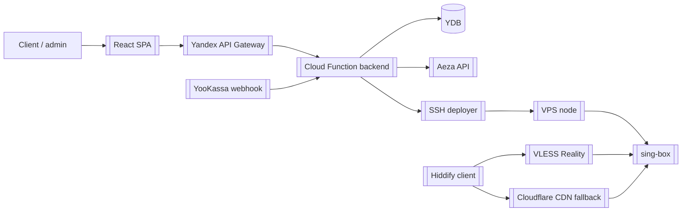

# Antygraviti MVP - Gatekeeper VPN Orchestrator

Локальный путь проекта:

```text
C:\Users\kobel\Project_Antygraviti\mvp_new
```

## Смысл проекта

`Antygraviti MVP` / `Gatekeeper VPN Orchestrator` - MVP SaaS-сервиса, который продает VPN-доступ и сам управляет серверной частью: принимает оплату, создает подписку, поднимает или переиспользует VPN-ноду, выдает пользователю VLESS-конфиги и синхронизирует список разрешенных UUID на сервере.

Проект совмещает личный кабинет, serverless-бэкенд, YDB, платежный webhook, автоматический provisioning VPS и эксплуатационные сценарии обхода DPI через Reality/CDN.

## Главные связи

- Backend: [[Yandex Cloud Serverless]], [[Yandex Database YDB]], [[JWT]]
- Frontend: [[React]], [[Vite]]
- VPN-слой: [[VLESS Reality]], [[sing-box]], [[Hiddify]], [[Cloudflare CDN]]
- Платежи: [[YooKassa]]
- VPS-провайдер: [[Aeza VPS]]
- Статика: [[Yandex Object Storage]]

## Ключевые возможности

- email OTP-авторизация и JWT-сессия;
- тарифы `solo_5`, `team_10`, `team_30`, `admin`;
- индивидуальный тариф на общей мультитенантной ноде;
- командные тарифы на выделенной ноде;
- webhook YooKassa `payment.succeeded` запускает provisioning;
- автоматический заказ VPS через Aeza API;
- SSH-деплой Docker + sing-box на ноду;
- генерация VLESS Reality-ссылок;
- публичная subscription-ссылка `/api/sub/<subId>/<token>` для Hiddify;
- добавление и отзыв ключей сотрудников/устройств;
- CDN-fallback через Cloudflare для сетей, где Reality режется DPI.

## Что читать первым

1. [[Antygraviti MVP - архитектура]]
2. [[Antygraviti MVP - данные и API]]
3. [[Команды Antygraviti MVP]]
4. [[Эксплуатация Antygraviti MVP]]
5. Документация в проекте: `AGENTS.md`, `docs/ops-memo.md`, `docs/client-setup.md`

## Схема высокого уровня



## Важные файлы

- `backend/src/index.ts` - единая точка входа Cloud Function и routing API.
- `backend/src/handlers/auth.ts` - OTP и JWT.
- `backend/src/handlers/billing.ts` - webhook YooKassa, подписки, provisioning.
- `backend/src/handlers/keys.ts` - управление ключами и subscription URL.
- `backend/src/handlers/key-links.ts` - сборка VLESS Reality/CDN-ссылок.
- `backend/src/orchestrator/orchestrator.ts` - полный цикл заказа и настройки VPS.
- `backend/src/orchestrator/ssh-deployer.ts` - Docker/sing-box конфиг на ноде.
- `backend/src/db/migrations.sql` - таблицы YDB.
- `frontend/src/App.tsx` - весь личный кабинет React.
- `gateway-config.yaml` - API Gateway + раздача статики.
- `deploy.ps1` - полный деплой в Yandex Cloud.
