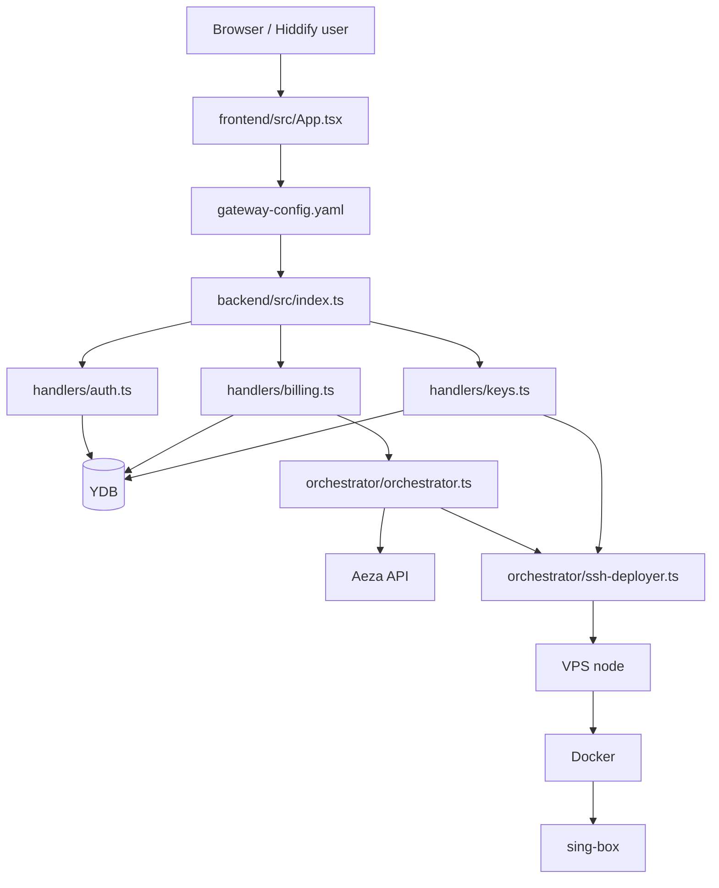

# Antygraviti MVP - архитектура

Связанный проект: [[Antygraviti MVP - Gatekeeper VPN Orchestrator]].

## Основной поток

## Backend

Backend - TypeScript/Node.js serverless-приложение под [[Yandex Cloud Serverless]]. Точка входа - `backend/src/index.ts`.

`index.ts` отвечает за:

- CORS;
- разбор path/proxy из API Gateway;
- JWT-аутентификацию защищенных роутов;
- публичные роуты авторизации;
- webhook биллинга;
- subscription URL;
- CRUD ключей через `/api/keys`;
- `/api/health`.

## Авторизация

Авторизация построена на email OTP и [[JWT]].

Поток:

1. `POST /api/auth/send-code` - отправляет/создает код.
2. `POST /api/auth/verify-code` - проверяет код и возвращает JWT.
3. Защищенные запросы передают `Authorization: Bearer <token>`.

JWT-секрет берется из `JWT_SECRET`; в `backend/src/config/env.ts` принцип fail-closed: если секрет не задан, код бросает ошибку вместо небезопасного дефолта.

## Billing и provisioning

`backend/src/handlers/billing.ts` принимает webhook [[YooKassa]]. При успешном `payment.succeeded`:

- проверяет `metadata.userId` и `metadata.tariffId`;
- валидирует тариф через `config/tariffs.ts`;
- делает dedupe по `payment_id`;
- создает или переиспользует подписку;
- для `individual` ищет/создает общую ноду;
- для `team` разворачивает выделенную ноду;
- переводит подписку в `active` или `failed`.

## Ноды VPN

`OrchestratorManager` делает полный цикл:

1. заказ VPS через [[Aeza VPS]];
2. ожидание active/IP;
3. получение или сброс root-пароля;
4. SSH-подключение;
5. установка Docker;
6. запуск [[sing-box]];
7. генерация Reality keypair и shortId;
8. сохранение `servers.config_data` в [[Yandex Database YDB]];
9. создание первого ключа или подготовка shared-ноды.

## Team vs individual

- `team` - выделенная нода `kind = dedicated`, один клиент на VPS, ключи выбираются по `server_id`.
- `individual` - общая нода `kind = shared`, много подписок на одной VPS, ключи изолируются через `subscription_id`.

Лимит общей ноды задает `MAX_INDIVIDUALS_PER_NODE`, по умолчанию `50`.

## Ключи и синхронизация

`backend/src/handlers/keys.ts`:

- находит живую подписку пользователя;
- резолвит ноду по `subscriptions.server_id` или legacy `servers.subscription_id`;
- добавляет ключ с новым UUID;
- проверяет лимит тарифа;
- после add/delete вызывает `syncNode`;
- `syncNode` берет все UUID ноды и перезаписывает конфиг sing-box через SSH.

На shared-ноде пользователь видит только свои ключи, но физический конфиг sing-box содержит UUID всех тенантов этой ноды.

## Frontend

Frontend - единый React SPA в `frontend/src/App.tsx`.

Ключевые состояния:

- `token`, `user`, `screen`;
- login step `email/code`;
- `server`, `keys`;
- `planType`, `maxKeys`, `subPath`;
- QR/modal для показа VLESS-ссылок.

Основные API-вызовы:

- `POST /api/auth/send-code`;
- `POST /api/auth/verify-code`;
- `GET /api/keys`;
- `POST /api/keys`;
- `DELETE /api/keys`;
- mock-вызов webhook `/api/billing/webhook` для локального сценария оплаты.

## Инфраструктура

`gateway-config.yaml` связывает:

- `/api/{proxy+}` -> Cloud Function;
- `/assets/{file+}` -> Object Storage;
- `/` -> `index.html` из Object Storage.

`deploy.ps1` собирает backend/frontend, обновляет Cloud Function, загружает статику и применяет конфиг API Gateway.

## Архитектурные решения

- Один serverless handler вместо отдельного постоянно работающего API-сервера.
- `YdbClient.getInstance()` переиспользуется между вызовами функции.
- Все YDB-запросы параметризованы через `DECLARE`.
- `servers.config_data` хранит JSON с root-паролем, Reality-ключами, routing/CDN-настройками.
- Subscription URL защищается не JWT, а неугадываемым `sub_token` в пути.
- CDN-профиль идет первым в subscription-списке, Reality остается быстрым fallback.

## Риски, которые помнить

- Webhook YooKassa в текущей архитектуре нужно дополнительно защищать проверкой подписи/источника перед продом.
- Provisioning может занимать минуты; он запускается из webhook, поэтому это чувствительное место.
- `servers.config_data` содержит чувствительные данные ноды; доступ к YDB и логам должен быть ограничен.
- SSH идет под root по паролю; для MVP это проще, но для зрелой версии лучше перейти на ключи/agent/ограниченный bootstrap.
