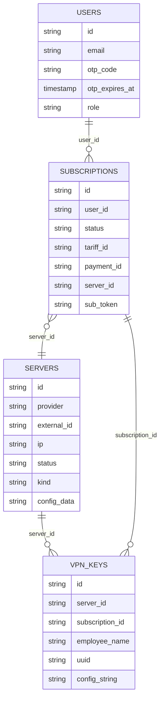

# Antygraviti MVP - данные и API

Связанный проект: [[Antygraviti MVP - Gatekeeper VPN Orchestrator]].

## Таблицы YDB

Источник: `backend/src/db/migrations.sql`.

### users

Клиенты и OTP-состояние.

Ключевые поля:

- `id` - UUID пользователя;
- `phone`;
- `email`;
- `otp_code`;
- `otp_expires_at`;
- `created_at`;
- `role`.

### subscriptions

Подписки клиентов/компаний.

Ключевые поля:

- `id`;
- `user_id`;
- `status` - `provisioning`, `active`, `failed`;
- `tariff_id`;
- `expires_at`;
- `payment_id`;
- `server_id` - назначенная нода;
- `sub_token` - секрет публичной subscription-ссылки.

### servers

VPN-ноды.

Ключевые поля:

- `id`;
- `subscription_id` - для dedicated legacy/выделенной ноды;
- `provider` - сейчас `aeza`;
- `external_id` - ID сервера у провайдера;
- `ip`;
- `status`;
- `config_data` - JSON с rootPassword, Reality-ключами, routing/CDN;
- `kind` - `dedicated` или `shared`.

### vpn_keys

Ключи сотрудников/устройств.

Ключевые поля:

- `id`;
- `server_id`;
- `subscription_id`;
- `employee_name`;
- `uuid`;
- `config_string`;
- `created_at`.

## Схема связей



## API авторизации

### POST /api/auth/send-code

Body:

```json
{ "email": "user@example.com" }
```

Назначение: отправить/создать OTP-код. В dev может вернуть `debugCode`.

### POST /api/auth/verify-code

Body:

```json
{ "email": "user@example.com", "code": "123456" }
```

Назначение: проверить OTP и вернуть JWT + пользователя.

## API биллинга

### POST /api/billing/webhook

Принимает уведомление [[YooKassa]] `payment.succeeded`.

Ожидает metadata:

```json
{
  "userId": "...",
  "tariffId": "solo_5"
}
```

Запускает создание подписки и provisioning ноды.

## API ключей

Все `/api/keys` требуют JWT.

### GET /api/keys

Возвращает сервер, ключи, тариф и subscription path.

Ключевые поля ответа:

- `server.ip`;
- `server.status`;
- `server.publicKey`;
- `server.cdnDomain`;
- `keys[]`;
- `planType`;
- `maxKeys`;
- `subPath`.

### POST /api/keys

Body:

```json
{ "employeeName": "Иван" }
```

Создает UUID, VLESS-ссылку, запись в YDB и синхронизирует sing-box на ноде.

### DELETE /api/keys

Body:

```json
{ "keyId": "..." }
```

Удаляет ключ и пересинхронизирует список UUID на ноде.

## Subscription URL

### GET /api/sub/&lt;subId&gt;/&lt;token&gt;

Публичный endpoint без JWT. Защита - неугадываемый `sub_token`.

Возвращает `text/plain` с base64-строкой, внутри которой список VLESS-ссылок. Если включен CDN, на каждый ключ отдается два профиля:

1. CDN VLESS + ws/httpupgrade + TLS через Cloudflare.
2. Reality VLESS прямым IP как fallback.

## Служебный endpoint

### GET /api/health

Возвращает:

```json
{ "status": "ok", "time": "..." }
```

## Тарифы

Источник: `backend/src/config/tariffs.ts`.

| id | Название | planType | maxKeys | Цена, руб/мес |
|---|---|---|---:|---:|
| `solo_5` | Персональный | `individual` | 5 | 300 |
| `team_10` | Команда | `team` | 10 | 5000 |
| `team_30` | Бизнес | `team` | 30 | 12000 |
| `admin` | Админ | `team` | 1000 | 0 |

`DEFAULT_MAX_KEYS = 100` для неизвестных/legacy-тарифов.

## Связи

- [[Yandex Database YDB]]
- [[YooKassa]]
- [[VLESS Reality]]
- [[sing-box]]
- [[Cloudflare CDN]]
