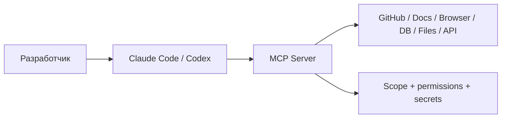

# MCP Servers - подборка из Instagram

> [!abstract] Проект-каталог MCP-серверов из Instagram Reel
> Цель — собрать серверы из исходного ролика, проверить официальные репозитории/документацию и зафиксировать, где каждый из них полезен в Claude Code, Codex и агентной разработке.

## Источник

- [Instagram Reel](https://www.instagram.com/reel/DcZAfR0o0Xy/?stkn=YTFuMjZyNGEyaG90)

## Статус

> [!warning] Источник пока не разобран автоматически
> Instagram не отдал содержимое Reel через текущий web-доступ, поэтому названия MCP-серверов из видео здесь намеренно **не угаданы**. Проект создан, источник сохранён; список нужно заполнить после чтения ролика через браузерный коннектор или по кадру/скриншоту с названиями.

## Что фиксировать по каждому MCP-серверу

| Поле | Что записываем |
|---|---|
| Название | Точное имя MCP-сервера |
| Назначение | Какую возможность даёт агенту |
| Официальный источник | GitHub / документация / MCP Registry |
| Установка | `npx`, `uvx`, `pip`, Docker или remote MCP |
| Требования | API key, OAuth, локальный сервис, Node/Python |
| Claude Code | Как подключать и когда использовать |
| Codex | Как подключать и когда использовать |
| Риски | Права на файлы, сеть, shell, БД, секреты |
| Наш сценарий | Где сервер полезен в текущей инженерной экосистеме |
| Статус | `candidate` / `test` / `approved` / `rejected` |

## MCP-серверы из ролика

_Ожидает точного извлечения названий из исходного Reel. Здесь не используются предположения, чтобы не загрязнять базу знаний неверными инструментами._

## Критерии отбора

1. Есть официальный или хорошо поддерживаемый репозиторий.
2. Понятна модель разрешений и область доступа.
3. Сервер можно подключить к Claude Code и/или Codex без лишней инфраструктуры.
4. Он решает повторяющуюся задачу, а не дублирует уже имеющийся инструмент.
5. Для корпоративного использования можно ограничить scope и секреты.
6. Есть смысл держать его включённым постоянно либо чётко описан режим «подключать по необходимости».

## Базовая схема использования

## Правила безопасности

- не выдавать MCP больше прав, чем требуется для конкретной задачи;
- для файловой системы ограничивать разрешённые каталоги;
- API-ключи хранить в переменных окружения / secret storage, а не в конфиге репозитория;
- write-доступ к GitHub, БД и инфраструктуре включать только там, где он действительно нужен;
- неизвестные community MCP сначала запускать в тестовом окружении;
- перед внедрением проверять активность репозитория, issues, releases и лицензии.

## Связи

- [[Полезные плагины]]
- [[Skills - Agent Skills и find-skills]]
- [[Claude Code — структура AI-assisted проекта]]
- [[Универсальный чек-лист среды проекта с AI-агентом]]
