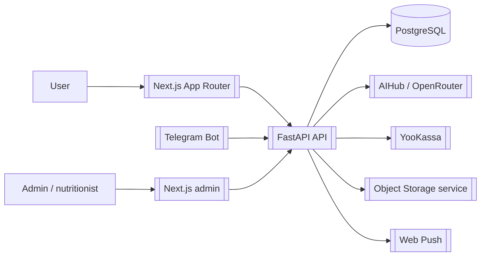

# NutryAI - ИИ-дневник питания

GitHub: `git@github.com:PavelKobe/NutryAI.git`

Локальный путь проекта:

```text
C:\Users\kobel\NutryAI\my-app
```

## Смысл проекта

`NutryAI` / `NutriAI Diary` - веб-приложение для питания и здоровья: пользователь ведет дневник еды, воды и веса, получает планы питания, рецепты, аналитику, рекомендации ИИ и коучинг. Продукт ориентирован на РФ/СНГ: русский интерфейс, рубли, локальные продукты, YooKassa, домен `nutriaidiary.com`.

Текущая живая реализация - монорепозиторий: [[FastAPI]] backend + [[Next.js App Router]] frontend/PWA + PostgreSQL/Alembic + YooKassa + Telegram bot.

## Главные связи

- Backend: [[FastAPI]], [[PostgreSQL]], [[SQLAlchemy 2 async]], [[Alembic]], [[Pydantic v2]]
- Frontend: [[Next.js App Router]], [[React]], [[PWA]]
- Auth: [[JWT]], email verification, OAuth Yandex/VK
- AI: [[AIHub]], [[OpenRouter]]
- Payments: [[YooKassa]]
- Storage: [[Yandex Object Storage]] / external OSS service
- Bot: [[Telegram Bot]]
- Product features: [[Barcode Scanner]], water/weight/meal tracking, coaching

## Ключевые возможности

- регистрация, email verification, JWT auth, refresh token;
- профиль пользователя и onboarding: цели, рост/вес, аллергии, бюджет, город, КБЖУ;
- дневник питания `meal_logs` с КБЖУ и микронутриентами;
- трекер воды и веса;
- планы питания и рецепты;
- чат с ИИ и AIHub proxy через OpenRouter;
- лимиты AI-запросов по подписке;
- продукты, пользовательские продукты и сканер штрихкодов;
- PWA, service worker, install banner, web push;
- YooKassa payments и активация Premium/coaching;
- админка пользователей, подписок, платежей, push и coaching;
- Telegram bot для еды, воды, веса, статистики, фото и напоминаний.

## Что читать первым

1. [[NutryAI - архитектура]]
2. [[NutryAI - данные и API]]
3. [[Команды NutryAI]]
4. [[Эксплуатация NutryAI]]
5. В проекте: `README.md`, `ИНСТРУКЦИЯ_ЗАПУСКА_DEV.md`, `MEMORY_BANK.md`, `app/backend/README.md`

## Схема высокого уровня



## Важные файлы

- `README.md` - текущая карта монорепозитория.
- `MEMORY_BANK.md` - правила миграций, индексы, deployment gotchas.
- `ИНСТРУКЦИЯ_ЗАПУСКА_DEV.md` - локальный запуск Windows/PowerShell.
- `app/backend/main.py` - FastAPI entrypoint, CORS, lifespan, auto-discovery роутеров.
- `app/backend/routers/` - HTTP API.
- `app/backend/models/` - SQLAlchemy-модели.
- `app/backend/services/` - бизнес-логика.
- `app/backend/alembic/versions/` - миграции.
- `app/web/src/app/` - Next.js App Router routes.
- `app/web/src/views/` - крупные пользовательские экраны.
- `app/web/src/components/` - UI, продуктовые и admin-компоненты.
- `app/docker-compose.yml` - api + web контейнеры.
- `app/scripts/vm_deploy_pull.sh` - VM deploy flow.
