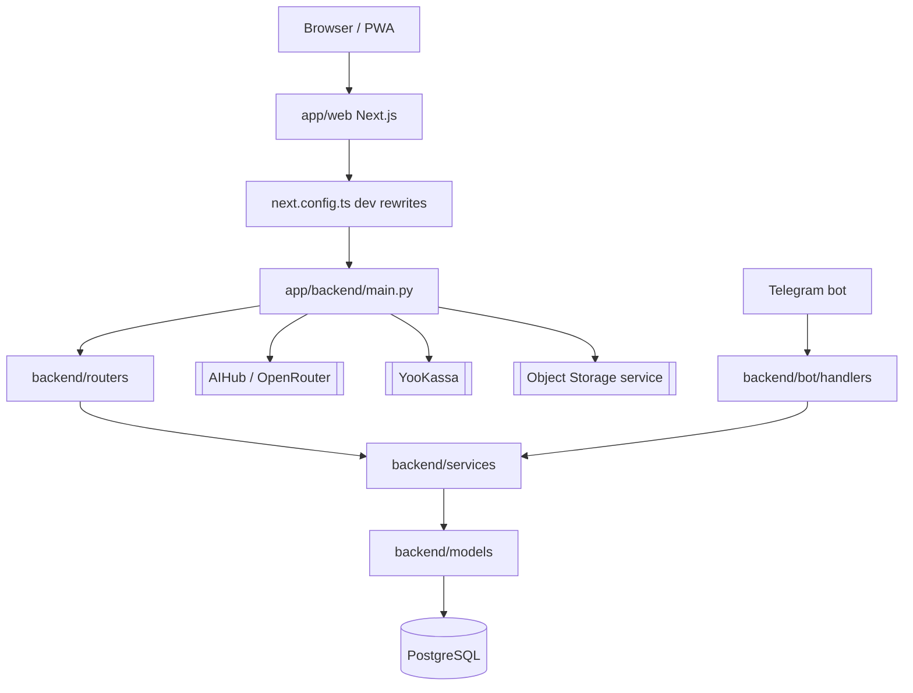

# NutryAI - архитектура

Связанный проект: [[NutryAI - ИИ-дневник питания]].

## Основной поток

## Backend

Backend построен на [[FastAPI]]. Главная точка входа - `app/backend/main.py`.

`main.py` делает:

- загрузку `app/backend/.env_development` вне production;
- инициализацию Sentry при `SENTRY_DSN`;
- CORS для `nutriaidiary.com` и localhost;
- rate limiting через `slowapi`;
- lifespan startup: `initialize_database`, `initialize_mock_data`, `initialize_admin_user`;
- auto-discovery всех `APIRouter` из `routers/`;
- dev/prod exception handling;
- `/` и `/health`.

## Backend слои

| Каталог | Роль |
|---|---|
| `routers/` | HTTP endpoints |
| `services/` | бизнес-логика и интеграции |
| `models/` | [[SQLAlchemy 2 async]] модели |
| `schemas/` | [[Pydantic v2]] DTO |
| `dependencies/` | FastAPI Depends: auth, db, subscription |
| `core/` | config, database, auth, limiter, crypto |
| `alembic/` | миграции [[PostgreSQL]] |
| `bot/` | [[Telegram Bot]] handlers/services |

## Frontend

Frontend - [[Next.js App Router]] в `app/web`.

Ключевые зоны:

- `src/app/` - routes: landing, login/register, dashboard, add-food, analytics, chat, meal-plan, products, admin;
- `src/views/` - крупные экраны приложения;
- `src/components/` - UI, product cards, barcode scanner, coaching, admin layout;
- `src/lib/` - API clients, payments/subscription API, auth, push, stats, nutrition calc;
- `public/sw.js`, `manifest.ts`, `PWAInstallBanner` - [[PWA]].

В dev `next.config.ts` проксирует `/api/*` на FastAPI `http://127.0.0.1:8000`.

## Auth

Есть несколько auth-потоков:

- email/password registration + email verification;
- login/refresh/logout/me через `/api/v1/auth`;
- OAuth Yandex/VK через `routers/oauth.py`;
- JWT через `JWT_SECRET_KEY`;
- admin bootstrap через env в dev.

## AI слой

`routers/aihub.py` открывает:

- `POST /api/v1/aihub/gentxt` - текст/мультимодальный запрос, умеет SSE streaming;
- `POST /api/v1/aihub/genimg` - генерация/редактирование изображений.

Перед AI-запросом dependency `check_ai_subscription` проверяет лимит подписки. Если AI-провайдер не отдал пользователю токены, запрос возвращается в квоту через `refund_ai_request`.

## Payments и подписки

`routers/payments.py` + `services/yookassa_service.py`:

- создают платеж [[YooKassa]];
- сохраняют локальную запись `payments`;
- webhook не доверяет телу напрямую: дополнительно фетчит платеж из YooKassa API;
- после `payment.succeeded` активирует Premium-подписку или coaching.

`services/subscription.py` управляет:

- free trial;
- daily AI limit;
- paid plan activation;
- downgrade/expired states.

## Telegram bot

`app/backend/bot` содержит bot handlers для:

- start/link user;
- логирования еды;
- воды;
- веса;
- статистики;
- фото;
- напоминаний.

Связь пользователя с Telegram хранится через `users.telegram_user_id`.

## Deployment

Docker/VM контур:

- `app/docker/Dockerfile.backend`
- `app/docker/Dockerfile.web`
- `app/docker-compose.yml`
- `app/scripts/vm_deploy_pull.sh`
- `app/scripts/vm_nginx_update.sh`

`docker-compose.yml` поднимает два сервиса: `api:8000` и `web:3000`. В контейнере web `INTERNAL_API_BASE_URL=http://api:8000` используется для server-side proxy/streaming API.

## Технические правила из MEMORY_BANK

- Перед новой Alembic-миграцией проверять heads.
- Держать одну линейную ветку миграций.
- Индексы писать через `Index`, не класть dict в `__table_args__`.
- Типовые индексы: `user_id`, `logged_at`, `(user_id, logged_at)` для логов.
- При barcode scan порядок: локальный кеш -> OpenFoodFacts -> FatSecret -> ручной ввод.
