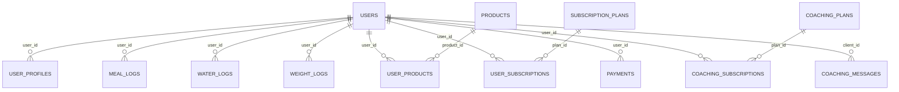

# NutryAI - данные и API

Связанный проект: [[NutryAI - ИИ-дневник питания]].

## Основные таблицы

Источник: `app/backend/models/` и Alembic migrations.

### Auth

- `users` - email, password hash, роль `user/admin`, active flag, email verification, `telegram_user_id`.
- `oidc_states` - state/nonce/code_verifier для OAuth.
- `email_verification_codes` - hash кода, expiry, attempts, last sent.

### Nutrition diary

- `user_profiles` - цели пользователя: пол, возраст, рост/вес, цель, активность, аллергии, кухня, бюджет, город, целевые КБЖУ и микронутриенты.
- `meal_logs` - приемы пищи: тип, название, calories/protein/fat/carbs, граммы, фото, дата, fiber/sugar/sodium/vitamins/minerals.
- `water_logs` - вода в мл и дата.
- `weight_logs` - вес и дата.
- `meal_plans` - недельные планы питания JSON/string.
- `recipes` - рецепты, кухня, КБЖУ, ингредиенты, инструкции, image_url.
- `chat_messages` - история AI-чата.

### Products

- `products` - глобальный кеш продуктов: barcode, slug, name, brand, image_url, `nutrition_100g`, category, source_api.
- `user_products` - коллекция пользователя: FK на product, custom_name, serving_g, stock_grams, category, tags, favorite.

### Billing / subscriptions / coaching

- `subscription_plans` - планы, цены, daily_ai_limit, trial_days, features.
- `user_subscriptions` - подписка пользователя, лимит AI-запросов за день, expiry/status.
- `payments` - локальные платежи YooKassa, amount, status, yookassa_payment_id, confirmation_url, product_type, coaching_plan_id.
- `coaching_plans`, `coaching_subscriptions`, `coaching_messages` - тарифы коучинга, подписки, переписка client/nutritionist.
- `push_subscriptions` - Web Push endpoint + keys.

## Схема данных

## API группы

### Auth

Prefix: `/api/v1/auth`

- `POST /register`
- `POST /login`
- `POST /verify-email`
- `POST /resend-verification`
- `POST /refresh`
- `GET /logout`
- `GET /me`
- `GET /yandex`, `GET /yandex/callback`
- `GET /vkid`, `GET /vkid/callback`

### User и профиль

- `GET /api/v1/users/profile`
- `PUT /api/v1/users/profile`
- CRUD `/api/v1/entities/user_profiles`

### Дневник питания

- CRUD `/api/v1/entities/meal_logs`
- `GET /api/v1/entities/meal_logs/test-micronutrients`
- `POST /api/v1/entities/meal_logs/cleanup-expired-photos`
- CRUD `/api/v1/entities/water_logs`
- `GET /api/v1/entities/water_logs/today`
- CRUD `/api/v1/entities/weight_logs`

### Планы, рецепты, чат

- CRUD `/api/v1/entities/meal_plans`
- CRUD `/api/v1/entities/recipes`
- CRUD `/api/v1/entities/chat_messages`
- `GET /api/v1/ai/nutrient-insight`

### Products и сканер

- `GET /api/v1/products`
- `GET /api/v1/products/categories`
- `GET /api/v1/products/all-slugs`
- `GET /api/v1/products/{slug}`
- CRUD `/api/v1/entities/user_products`
- `GET /api/v1/entities/user_products/for-ai`
- `POST /api/v1/entities/user_products/check-shopping-item`
- `POST /api/v1/scan`

Порядок scan из `MEMORY_BANK.md`: local `products` cache -> OpenFoodFacts -> FatSecret -> ручной ввод.

### AIHub

- `POST /api/v1/aihub/gentxt` - текст/мультимодальный запрос; `stream=true` возвращает SSE.
- `POST /api/v1/aihub/genimg` - text-to-image / image-to-image.

AI endpoints связаны с подпиской: daily quota списывается перед запросом и возвращается, если провайдер ничего не доставил.

### Payments и подписки

- `POST /api/v1/payments/create`
- `GET /api/v1/payments/my`
- `GET /api/v1/payments/{payment_id}`
- `POST /api/v1/payments/webhook`
- `GET /api/v1/subscription/status`
- `GET /api/v1/subscription/plans`

### Coaching

- `GET /api/v1/coaching/plan`
- `GET /api/v1/coaching/status`
- `POST /api/v1/coaching/payments/create`
- `GET /api/v1/coaching/messages`
- `POST /api/v1/coaching/messages`

### Admin

- `/api/v1/admin/users`
- `/api/v1/admin/subscriptions`, `/api/v1/admin/plans`
- `/api/v1/admin/payments`
- `/api/v1/admin/coaching`
- `/api/v1/admin/push`
- `/api/v1/admin/settings`

### Storage и push

- `/api/v1/storage/*` - bucket/object/list/upload-url/download-url через external OSS service.
- `/api/v1/push/*` - VAPID key, subscribe, unsubscribe, unread-counts, coaching mark-read, test.

## Важные env

- `DATABASE_URL`
- `JWT_SECRET_KEY`, `JWT_ALGORITHM`, `JWT_EXPIRE_MINUTES`
- `FRONTEND_URL`, `PYTHON_BACKEND_URL`
- `APP_AI_BASE_URL`, `APP_AI_KEY`, `APP_AI_PROXY`
- `YOOKASSA_SHOP_ID`, `YOOKASSA_SECRET_KEY`, `YOOKASSA_RETURN_URL`
- `OSS_SERVICE_URL`, `OSS_API_KEY`
- `TELEGRAM_BOT_TOKEN`
- `RESEND_API_KEY`, `RESEND_FROM_EMAIL`, `RESEND_FROM_NAME`
- `ENVIRONMENT`, `PORT`, `CORS_EXTRA_ORIGINS`
- frontend: `NEXT_PUBLIC_API_BASE_URL`, `NEXT_PUBLIC_SITE_URL`

## Связи

- [[FastAPI]]
- [[PostgreSQL]]
- [[Alembic]]
- [[YooKassa]]
- [[AIHub]]
- [[Barcode Scanner]]
- [[PWA]]
