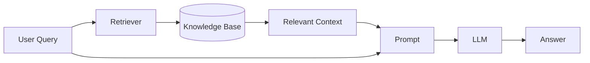
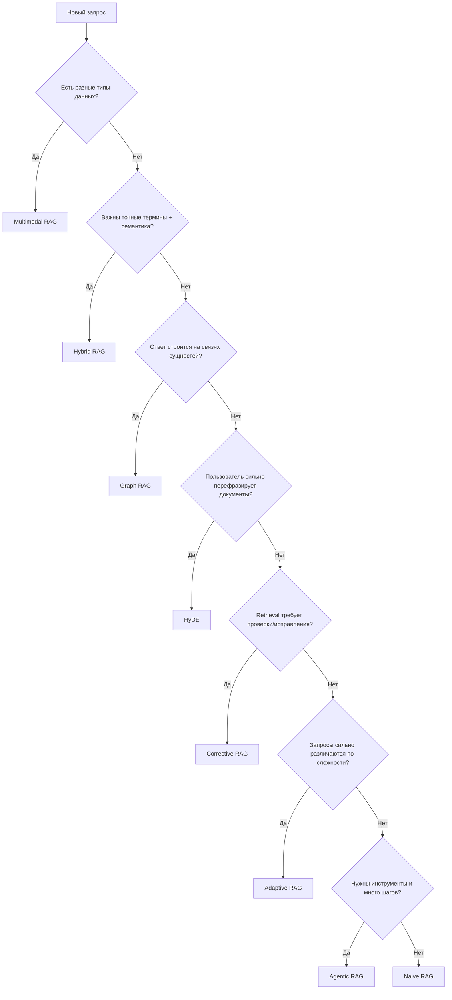

# RAG архитектура

> [!abstract] Проект
> Практический справочник по 8 архитектурам Retrieval-Augmented Generation (RAG) с визуальным HTML-шаблоном для изучения, архитектурных ревью и выбора подхода под задачу.

## Источник идеи

- Instagram: https://www.instagram.com/p/DdQWQ18jj91/?stkn=bHMyYm43OTI5c2d1
- Автор поста: `codewithbrij`
- В посте показана инфографика по 8 вариантам RAG. Готового HTML-кода или ссылки на шаблон в публикации нет, поэтому HTML в этом проекте — собственная реализация по мотивам структуры инфографики.

## HTML-шаблон

- [[rag-architectures.html]]
- Файл: `rag-architectures.html`
- Назначение: интерактивная визуальная шпаргалка по архитектурам RAG.

## 8 архитектур RAG

| Архитектура | Когда применять | Ключевая идея |
|---|---|---|
| Naive RAG | Простые вопросы по базе знаний | Query → embedding → vector search → context → LLM |
| Multimodal RAG | Документы содержат текст, изображения, аудио, таблицы | Поиск по нескольким модальностям |
| HyDE | Формулировка вопроса сильно отличается от формулировок в документах | Сначала создать гипотетический ответ, затем искать похожие документы |
| Corrective RAG | Ретривер часто возвращает правдоподобные, но слабые чанки | Оценить качество retrieval и при необходимости исправить/расширить поиск |
| Graph RAG | Ответ зависит от связей между сущностями | Knowledge Graph + graph retrieval |
| Hybrid RAG | Нужны и семантический, и точный поиск | Dense/vector + keyword/BM25 и/или graph retrieval |
| Adaptive RAG | Сложность запросов сильно различается | Router выбирает: без поиска, простой retrieval или многошаговый сценарий |
| Agentic RAG | Путь к ответу заранее неизвестен | Агент планирует, вызывает инструменты и делает несколько циклов retrieval |

## Базовая модель RAG

## Как выбирать архитектуру

## Практический стек

### Минимальный MVP

- API: FastAPI
- LLM: OpenAI / локальная модель через совместимый API
- Embeddings: модель эмбеддингов
- Vector DB: Qdrant или PostgreSQL + pgvector
- Парсинг: PDF/HTML/Markdown → нормализованный текст
- Chunking: semantic/recursive chunking
- Retrieval: top-k + metadata filters
- Observability: логирование query, retrieved chunks, latency, token usage

### Для production

- reranker после первичного retrieval;
- hybrid search (dense + sparse/BM25);
- metadata filtering и ACL;
- evaluation dataset;
- retrieval metrics: Recall@K, MRR, nDCG;
- answer metrics: faithfulness, groundedness, correctness;
- tracing и feedback loop;
- защита от prompt injection в retrieved content;
- versioning документов и индекса.

## Рекомендуемая эволюция проекта

1. Начать с Naive RAG и получить работающий end-to-end pipeline.
2. Добавить reranking и hybrid retrieval.
3. Ввести evaluation-набор и измерять качество retrieval отдельно от качества LLM.
4. Добавить router и перейти к Adaptive RAG, если запросы неоднородны.
5. Graph RAG использовать только когда связи действительно являются частью задачи.
6. Agentic RAG подключать для сценариев, где нужны инструменты, планирование и многократный поиск.

## Связи

- [[Claude Code — структура AI-assisted проекта]]
- [[Универсальный чек-лист среды проекта с AI-агентом]]
- [[Skills - Agent Skills и find-skills]]

## Статус

`active / learning`
