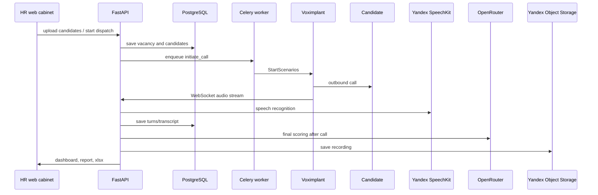

# VoiceScreen - архитектура

Связанный проект: [[VoiceScreen - голосовой AI-скрининг]].

## Основной поток звонка

## Backend

Основной backend - [[FastAPI]] приложение в `app/main.py`.

Ключевые части:

- `app/api/router.py` - сборка REST и WebSocket роутеров под `/api/v1`;
- `app/config.py` - настройки через `pydantic-settings`;
- `app/db/models.py` - SQLAlchemy-модели;
- `app/core/dialog.py` - сценарная FSM логика звонка;
- `app/core/scoring.py` - финальная оценка кандидата;
- `app/core/stt.py` - SpeechKit STT;
- `app/core/llm.py` - OpenRouter client;
- `app/api/ws.py` - WebSocket для VoxEngine;
- `app/telephony/voximplant.py` - Voximplant Management API;
- `app/workers/tasks.py` - Celery задачи;
- `app/storage/yos.py` - Yandex Object Storage;
- `app/notifications/` - email и SMS уведомления.

## Важная идея

Во время звонка LLM не используется на каждом ходе. `DialogSession` идет по заранее заданному сценарию вопросов, а LLM применяется для финального scoring/summary после завершения звонка.

Это снижает задержку во время живого разговора и делает поведение агента предсказуемее.

## Frontend

В проекте есть два frontend-приложения:

- `web/` - web-кабинет клиента на [[React]] + [[Vite]];
- `landing/` - публичный лендинг на [[React]] + [[Vite]].

## Инфраструктура

- локально: `docker compose` поднимает PostgreSQL, Redis, API, worker и bot;
- production: Yandex Cloud VM, nginx + TLS, домены `voxscreen.ru` и `app.voxscreen.ru`;
- web SPA собирается в `web/dist` и деплоится на VM.
