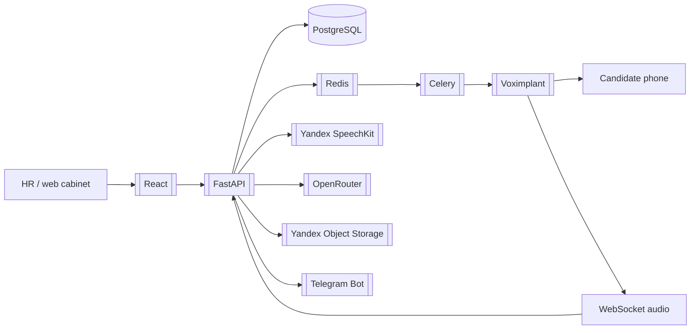

# VoiceScreen - голосовой AI-скрининг

GitHub: `https://github.com/PavelKobe/VoiceScreen.git`

Временная локальная копия для анализа:

```text
C:\tmp\VoiceScreen
```

## Смысл проекта

`VoiceScreen` - MVP голосового AI-агента для первичного скрининга кандидатов на массовые позиции: курьеры, кассиры, комплектовщики и похожие роли.

HR загружает список кандидатов, система обзванивает их через телефонию, задает вопросы по сценарию, сохраняет расшифровку, оценку, решение и запись звонка. После этого HR получает шорт-лист и может смотреть детали в web-кабинете.

## Главные связи

- Backend: [[FastAPI]], [[Pydantic v2]], [[SQLAlchemy 2 async]], [[PostgreSQL]], [[Alembic]]
- Очереди: [[Redis]], [[Celery]]
- Голос и телефония: [[Voximplant]], [[Yandex SpeechKit]], [[AI Voice Screening]]
- LLM: [[OpenRouter]]
- Хранилище записей: [[Yandex Object Storage]]
- Интерфейсы: [[React]], [[Vite]], [[Telegram Bot]]
- Auth: [[Session Cookie Auth]]
- Инфраструктура: [[Docker Compose]], [[Nginx Prometheus]]

## Ключевые возможности

- загрузка кандидатов из CSV/XLSX;
- создание вакансий и сценариев скрининга;
- планирование обзвона с учетом временного окна;
- исходящие звонки через Voximplant;
- WebSocket-аудио из VoxEngine в backend;
- STT/TTS через Yandex SpeechKit;
- сценарный диалог без LLM на каждом turn;
- финальная оценка через LLM после звонка;
- хранение записей в Yandex Object Storage;
- email и SMS-уведомления;
- web-кабинет на React/Vite;
- Telegram bot для HR;
- landing и демо-заявки.

## Что читать первым

1. [[VoiceScreen - архитектура]]
2. [[VoiceScreen - данные и API]]
3. [[Команды VoiceScreen]]
4. [[Деплой VoiceScreen и инфраструктура]]

## Схема высокого уровня


