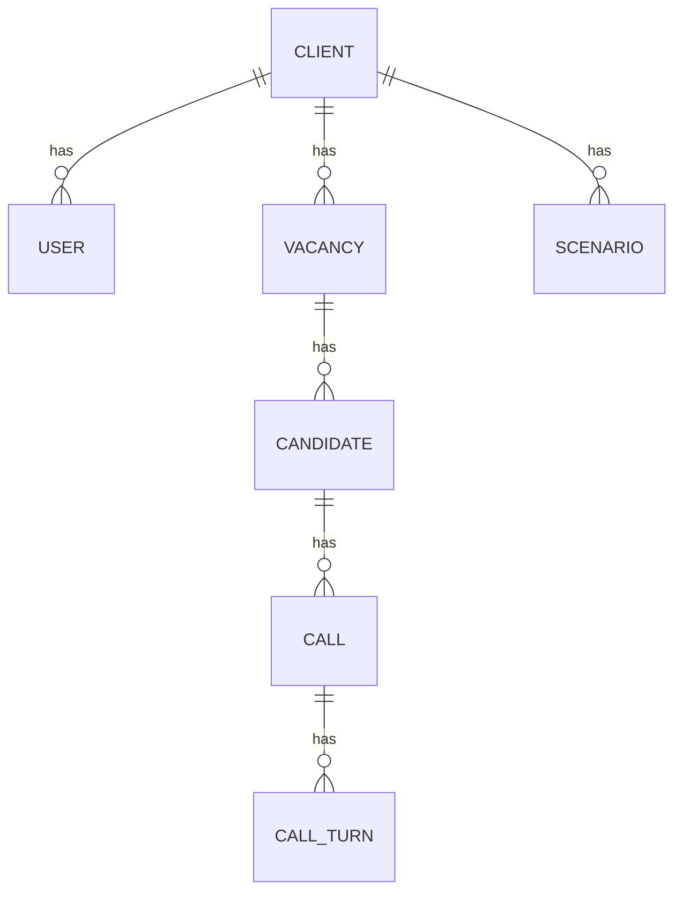

# VoiceScreen - данные и API

Связанный проект: [[VoiceScreen - голосовой AI-скрининг]].

## Основные сущности

- `Client` - клиент системы, API key, тариф, Telegram chat id.
- `User` - пользователь клиента для web-кабинета.
- `Scenario` - сценарий анкеты и вопросы.
- `Vacancy` - вакансия, pass score, dispatch, call slots, уведомления.
- `Candidate` - кандидат, телефон, ФИО, статус, попытки, next_attempt_at.
- `Call` - звонок, transcript, score, decision, answers, summary, recording_url.
- `CallTurn` - отдельная реплика диалога.
- `LandingDemo` - демо-звонки для лендинга.

## API-группы

Все основные REST endpoints собраны под `/api/v1`.

- `/auth` - login/logout/me, session-cookie auth;
- `/dashboard` - агрегаты для главного экрана;
- `/clients` - клиенты и API keys;
- `/clients/{client_id}/users` - пользователи клиента;
- `/team` - команда клиента;
- `/scenarios` - сценарии анкет;
- `/vacancies` - вакансии, dispatch, отчеты, xlsx;
- `/candidates` - кандидаты, upload, ручной звонок, reset attempts;
- `/calls` - звонки, детали, presigned recording;
- `/webhooks` - события Voximplant;
- `/ws` - WebSocket audio stream;
- `/landing` - публичные ручки лендинга;
- `/admin/landing-demos` - админка демо-звонков.

## Auth

В проекте есть два режима доступа:

- `X-API-Key` для клиентских API-интеграций;
- session-cookie после `POST /auth/login` для web-кабинета.

Связь: [[Session Cookie Auth]].

## Схема данных

## Миграции

Миграции лежат в `alembic/versions` и покрывают схему, Voximplant id, кандидатов, dispatch state, scoring fields, scenarios, users, client api key, call slots, dispatch paused и landing demos.

Связи:

- [[PostgreSQL]]
- [[SQLAlchemy 2 async]]
- [[Alembic]]
