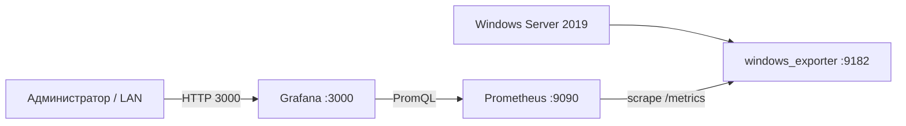

# Windows Server 2019 - мониторинг Prometheus + Grafana

## Цель

Построить локальный мониторинг Windows Server 2019, чтобы видеть в реальном времени и в истории:

- загрузку CPU;
- использование RAM;
- свободное место и I/O дисков;
- сетевую активность;
- количество процессов и потоков;
- какие процессы потребляют CPU и память;
- состояние Windows Services;
- перезагрузки и доступность сервера;
- историю метрик и графики;
- алерты при превышении порогов.

Это серверный аналог идеи `btop`, но с историей, дашбордами и возможностью уведомлений.

## Стек

| Компонент | Роль | Порт |
|---|---|---:|
| `windows_exporter` | Снимает метрики Windows и процессов | `9182` |
| `Prometheus` | Забирает и хранит временные ряды | `9090` |
| `Grafana` | Дашборды и визуализация | `3000` |
| `NSSM` | Запуск Prometheus/Grafana как Windows Services при необходимости | — |

Рекомендуемая схема для одного Windows Server 2019:



Если всё установлено на одном сервере, `windows_exporter` и Prometheus лучше привязать к `127.0.0.1`. В локальную сеть открывать только Grafana `3000/tcp` и ограничить доступ корпоративной подсетью.

## Версии на момент создания заметки

Дата проверки: **2026-09-10**.

- windows_exporter: актуальная ветка `0.31.x` (на момент проверки опубликована `0.31.8`).
- Prometheus: стабильная `3.14.0`; для сервера можно предпочесть LTS `3.13.3`.
- Grafana: актуальная документация `v13.2`.

Перед установкой production-сервера проверить текущие stable/LTS релизы на официальных страницах.

---

# Установка на Windows Server 2019

Все команды PowerShell выполнять **от имени администратора**.

## 1. Создать каталоги

```powershell
New-Item -ItemType Directory -Force C:\Monitoring
New-Item -ItemType Directory -Force C:\Monitoring\Prometheus
New-Item -ItemType Directory -Force C:\Monitoring\Prometheus\data
New-Item -ItemType Directory -Force C:\Monitoring\Grafana
```

Если для мониторинга есть отдельный SSD, каталог данных Prometheus лучше разместить на нём.

---

## 2. Установить windows_exporter

Официальный репозиторий:

`https://github.com/prometheus-community/windows_exporter`

Скачать MSI из Releases и установить.

Для нашего сценария важны collectors:

```text
cpu,cpu_info,logical_disk,memory,net,os,physical_disk,process,service,system,tcp
```

Пример установки MSI:

```powershell
msiexec /i .\windows_exporter-0.31.8-amd64.msi ENABLED_COLLECTORS="cpu,cpu_info,logical_disk,memory,net,os,physical_disk,process,service,system,tcp" LISTEN_ADDR="127.0.0.1" LISTEN_PORT="9182"
```

MSI устанавливает `windows_exporter` как Windows Service.

Проверить службу:

```powershell
Get-Service windows_exporter
```

Ожидаемое состояние:

```text
Status : Running
```

Проверить метрики:

```powershell
Invoke-WebRequest http://127.0.0.1:9182/metrics -UseBasicParsing
```

Или открыть на самом сервере:

```text
http://127.0.0.1:9182/metrics
```

Если выводятся строки `windows_*`, exporter работает.

### Почему включён `process`

Этот collector позволяет увидеть, какой конкретно процесс ест CPU/RAM/I/O. Он не включён в windows_exporter по умолчанию, поэтому для задачи «процессы под контролем» включаем его явно.

### Почему включён `service`

Позволяет контролировать состояния Windows Services: running/stopped/paused и т.д.

---

## 3. Установить Prometheus

Официальная загрузка:

`https://prometheus.io/download/`

Для стабильного WS19 рекомендуется использовать актуальную LTS-ветку Prometheus, если она доступна.

Скачать Windows AMD64 ZIP и распаковать содержимое в:

```text
C:\Monitoring\Prometheus
```

Пример структуры:

```text
C:\Monitoring\Prometheus\
  prometheus.exe
  promtool.exe
  prometheus.yml
  data\
```

---

## 4. Настроить prometheus.yml

Создать/заменить:

```text
C:\Monitoring\Prometheus\prometheus.yml
```

Содержимое:

```yaml
global:
  scrape_interval: 15s
  evaluation_interval: 15s

scrape_configs:
  - job_name: windows-server-2019
    static_configs:
      - targets:
          - 127.0.0.1:9182
        labels:
          server: ws19
```

Проверить конфигурацию:

```powershell
cd C:\Monitoring\Prometheus
.\promtool.exe check config .\prometheus.yml
```

Ожидаем:

```text
SUCCESS
```

---

## 5. Первый запуск Prometheus

```powershell
cd C:\Monitoring\Prometheus
.\prometheus.exe `
  --config.file="C:\Monitoring\Prometheus\prometheus.yml" `
  --storage.tsdb.path="C:\Monitoring\Prometheus\data" `
  --storage.tsdb.retention.time=30d `
  --web.listen-address="127.0.0.1:9090"
```

Проверить:

```text
http://127.0.0.1:9090
```

Открыть:

```text
Status -> Targets
```

Target `windows-server-2019` должен иметь состояние:

```text
UP
```

Быстрая проверка PromQL:

```promql
up{job="windows-server-2019"}
```

Результат `1` означает, что Prometheus получает метрики.

---

## 6. Запустить Prometheus как Windows Service

Prometheus сам по себе является консольным приложением. Для постоянной работы на WS19 удобно использовать service wrapper `NSSM`.

Официальный сайт:

`https://nssm.cc/`

После установки NSSM:

```powershell
nssm install Prometheus
```

В окне указать:

```text
Path:
C:\Monitoring\Prometheus\prometheus.exe

Startup directory:
C:\Monitoring\Prometheus

Arguments:
--config.file=C:\Monitoring\Prometheus\prometheus.yml --storage.tsdb.path=C:\Monitoring\Prometheus\data --storage.tsdb.retention.time=30d --web.listen-address=127.0.0.1:9090
```

Запустить:

```powershell
Start-Service Prometheus
Get-Service Prometheus
```

Для production желательно настроить в NSSM автоматический restart процесса при падении.

---

# Grafana

## 7. Установить Grafana

Официальная инструкция Windows:

`https://grafana.com/docs/grafana/latest/setup-grafana/installation/windows/`

Можно использовать Windows installer или ZIP.

Если используется ZIP, распаковать в:

```text
C:\Monitoring\Grafana
```

Для запуска вручную:

```powershell
cd C:\Monitoring\Grafana\bin
.\grafana-server.exe
```

По умолчанию Grafana доступна:

```text
http://localhost:3000
```

Grafana официально допускает запуск Windows-версии как службы через NSSM.

---

## 8. Добавить Prometheus в Grafana

Открыть Grafana:

```text
http://<IP_WS19>:3000
```

Далее:

```text
Connections
  -> Data sources
     -> Add data source
        -> Prometheus
```

URL:

```text
http://127.0.0.1:9090
```

Нажать:

```text
Save & test
```

Должно появиться подтверждение успешного подключения.

---

# Основные PromQL-запросы

## CPU сервера, %

```promql
100 - (avg by (instance) (rate(windows_cpu_time_total{mode="idle"}[5m])) * 100)
```

## RAM, % использования

```promql
(1 - windows_memory_available_bytes / windows_memory_physical_total_bytes) * 100
```

## Свободная RAM, GB

```promql
windows_memory_available_bytes / 1024 / 1024 / 1024
```

## Использование дисков, %

```promql
(1 - windows_logical_disk_free_bytes / windows_logical_disk_size_bytes) * 100
```

Примечание: метрики размера/свободного места Windows logical disk могут обновляться с задержкой порядка 10-15 минут.

## Количество процессов

```promql
windows_system_processes
```

## Top-10 процессов по CPU

```promql
topk(10,
  sum by (process) (
    rate(windows_process_cpu_time_total[5m])
  ) * 100
)
```

## Top-10 процессов по private working set

```promql
topk(10,
  sum by (process) (
    windows_process_working_set_private_bytes
  )
)
```

## Top-10 процессов по private bytes

```promql
topk(10,
  sum by (process) (
    windows_process_private_bytes
  )
)
```

## Остановленные Windows Services

```promql
windows_service_state{state="stopped"} == 1
```

## Проверка конкретной службы

Пример для службы `MyService`:

```promql
windows_service_state{name="MyService",state="running"} == 1
```

## Сервер доступен Prometheus

```promql
up{job="windows-server-2019"}
```

---

# Рекомендуемый дашборд Grafana

Собрать один дашборд `WS19 System Control` со следующими панелями:

```text
ROW 1 — Health
  Server UP
  Uptime
  CPU %
  RAM %
  Disk C: %

ROW 2 — Processes
  Top CPU processes
  Top RAM processes
  Process count
  Thread count

ROW 3 — Disks
  Free space
  Read bytes/sec
  Write bytes/sec
  Disk busy time

ROW 4 — Services
  Critical services
  Stopped services

ROW 5 — Network
  Receive bytes/sec
  Transmit bytes/sec
  TCP connections
```

Можно также импортировать готовый community dashboard для `windows_exporter`, но production-дашборд лучше адаптировать под реально используемые на сервере службы и приложения.

---

# Алерты

Минимальный набор:

| Событие | Порог |
|---|---|
| Server Down | `up == 0` более 1 мин |
| High CPU | CPU > 90% более 5 мин |
| High RAM | RAM > 90% более 5 мин |
| Disk almost full | занято > 90% |
| Critical service stopped | выбранная служба не `running` |

Пример Prometheus rule:

```yaml
groups:
  - name: ws19
    rules:
      - alert: WindowsServerDown
        expr: up{job="windows-server-2019"} == 0
        for: 1m
        labels:
          severity: critical
        annotations:
          summary: "Windows Server 2019 недоступен"

      - alert: WindowsHighCPU
        expr: 100 - (avg by (instance) (rate(windows_cpu_time_total{mode="idle"}[5m])) * 100) > 90
        for: 5m
        labels:
          severity: warning
        annotations:
          summary: "CPU выше 90%"

      - alert: WindowsHighMemory
        expr: (1 - windows_memory_available_bytes / windows_memory_physical_total_bytes) * 100 > 90
        for: 5m
        labels:
          severity: warning
        annotations:
          summary: "RAM выше 90%"
```

Для отправки уведомлений можно позже добавить Grafana Alerting или Alertmanager.

---

# Firewall и безопасность

Для схемы «всё на одном WS19»:

- `9182` windows_exporter — только `127.0.0.1`;
- `9090` Prometheus — только `127.0.0.1`;
- `3000` Grafana — разрешить только из корпоративной LAN;
- не публиковать ни один из этих портов напрямую в Internet;
- сменить пароль Grafana admin после первого входа;
- создать отдельные Grafana users/roles для сотрудников;
- перед production при необходимости поставить reverse proxy + HTTPS.

Пример правила Windows Firewall для Grafana — заменить подсеть на свою:

```powershell
New-NetFirewallRule `
  -DisplayName "Grafana LAN" `
  -Direction Inbound `
  -Protocol TCP `
  -LocalPort 3000 `
  -RemoteAddress 192.168.0.0/16 `
  -Action Allow
```

---

# Ежедневное использование

Администратору не нужно постоянно держать открытым PowerShell.

Рабочий сценарий:

```text
1. Открыть Grafana.
2. Посмотреть Server UP / CPU / RAM / Disk.
3. Если CPU высокий -> открыть Top CPU Processes.
4. Если RAM высокая -> открыть Top RAM Processes.
5. Если приложение не отвечает -> проверить Critical Services.
6. Увеличить диапазон времени до 6h / 24h / 7d и увидеть, когда началась проблема.
7. После определения процесса перейти на сервер и проверить его через Task Manager / PowerShell.
```

Полезные локальные команды:

```powershell
# Top процессов по CPU
Get-Process | Sort-Object CPU -Descending | Select-Object -First 15

# Top процессов по RAM
Get-Process | Sort-Object WorkingSet64 -Descending | Select-Object -First 15 Name,Id,CPU,WorkingSet64

# Службы мониторинга
Get-Service windows_exporter,Prometheus

# Проверить exporter
Invoke-WebRequest http://127.0.0.1:9182/metrics -UseBasicParsing

# Проверить Prometheus
Invoke-WebRequest http://127.0.0.1:9090/-/healthy -UseBasicParsing
```

---

# Диагностика

## Prometheus показывает target DOWN

Проверить:

```powershell
Get-Service windows_exporter
Test-NetConnection 127.0.0.1 -Port 9182
Invoke-WebRequest http://127.0.0.1:9182/metrics -UseBasicParsing
```

Затем проверить `prometheus.yml`:

```powershell
C:\Monitoring\Prometheus\promtool.exe check config C:\Monitoring\Prometheus\prometheus.yml
```

## Не видны метрики процессов

Проверить, что collector `process` включён.

В `/metrics` должны присутствовать метрики вида:

```text
windows_process_cpu_time_total
windows_process_working_set_private_bytes
windows_process_private_bytes
```

## Grafana не видит Prometheus

На WS19 проверить:

```powershell
Test-NetConnection 127.0.0.1 -Port 9090
```

В Grafana Data Source URL должен быть:

```text
http://127.0.0.1:9090
```

---

# Этапы внедрения

- [ ] Установить windows_exporter.
- [ ] Проверить `/metrics`.
- [ ] Установить Prometheus.
- [ ] Настроить `prometheus.yml`.
- [ ] Проверить Target = UP.
- [ ] Установить Grafana.
- [ ] Подключить Prometheus Data Source.
- [ ] Создать `WS19 System Control` dashboard.
- [ ] Добавить Top CPU / Top RAM processes.
- [ ] Добавить контроль критичных Windows Services.
- [ ] Настроить алерты CPU/RAM/Disk/Service Down.
- [ ] Ограничить Grafana firewall-правилом LAN.
- [ ] Настроить автозапуск Prometheus и Grafana.

## Результат

После внедрения получаем постоянный центр наблюдения за WS19:

```text
Windows Server 2019
       ↓
windows_exporter
       ↓
Prometheus
       ↓
Grafana
       ↓
CPU / RAM / DISK / NETWORK / PROCESSES / SERVICES / HISTORY / ALERTS
```

Это предпочтительнее `btop` для Windows Server 2019, потому что система работает постоянно, хранит историю и позволяет видеть проблему не только «прямо сейчас», но и после события.