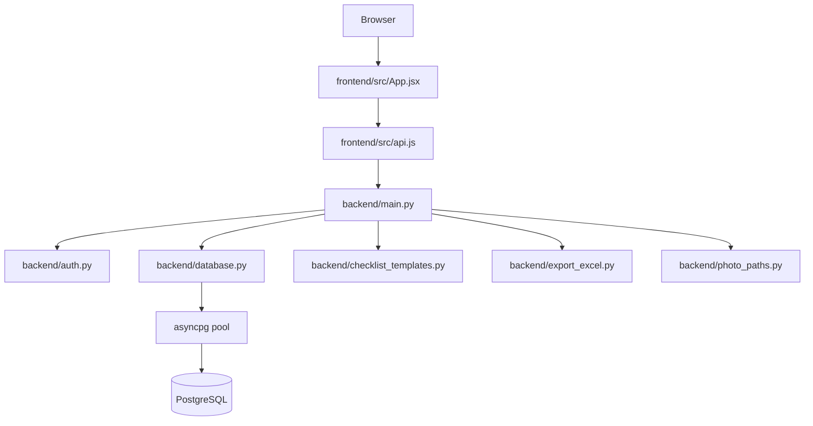

# retail-audit-kit - архитектура

Связанный проект: [[retail-audit-kit - корпоративный аудит розницы]].

## Основной поток

## Backend

Backend построен на [[FastAPI]]. Главный файл - `backend/main.py`.

Он отвечает за:

- создание приложения;
- CORS;
- lifespan: загрузка конфигурации фото и инициализация пула БД;
- endpoints проверок;
- endpoints шаблонов;
- экспорт Excel;
- KPI;
- фото-прокси;
- `/health` и `/version`.

## База данных

Вместо ORM runtime используется [[asyncpg]] напрямую через connection pool.

Файл `backend/database.py` содержит:

- `init_db_pool`;
- `get_db` dependency;
- CRUD по `security_checks`;
- форматирование дат;
- кеширование завершенных проверок;
- журнал действий пользователей;
- director feedback.

Миграции управляются через [[Alembic]].

## Frontend

Frontend построен на [[React]] + [[Vite]]. Главный файл - `frontend/src/App.jsx`.

Ключевые компоненты:

- `DynamicCheckForm.jsx` - заполнение чек-листа;
- `TemplatePicker.jsx` - выбор шаблона;
- `ChecklistConstructor.jsx` - конструктор;
- `ChecklistTemplateEditor.jsx` - редактирование шаблонов;
- `SbRetailCheckHistory.jsx` - история;
- `SbRetailStats.jsx` - статистика;
- `SbRetailViolationsReport.jsx` - нарушения;
- `UserActionsLog.jsx` - журнал действий;
- `KpiSection.jsx` - KPI.

## Авторизация

[[HTTP Basic Auth]] реализован в `backend/auth.py`.

Пользователи читаются из `.env`:

- `USERS_admin`
- `USERS_users`
- fallback: `ADMIN_USERNAME` / `ADMIN_PASSWORD`

## Особенность проекта

Сохраненная проверка хранит не только ответы, но и `template_snapshot`. Это защищает старые проверки от поломки, если шаблон позже изменили.

Связь: [[Checklist Templates]].
