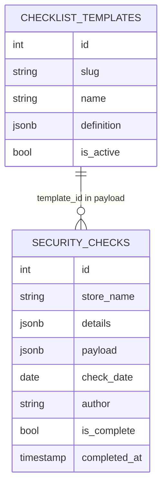

# retail-audit-kit - данные и API

Связанный проект: [[retail-audit-kit - корпоративный аудит розницы]].

## Основные таблицы

### security_checks

Хранит результаты проверок.

Ключевые поля:

- `store_name` - объект проверки;
- `total_score` - зарезервированное поле итогового процента;
- `grade` - зарезервированная категория;
- `details` - расчет по блокам;
- `payload` - ответы формы, `template_id`, `template_snapshot`, `template_name`;
- `check_date`;
- `author`;
- `is_complete`;
- `completed_at`.

### checklist_templates

Хранит шаблоны форм.

Ключевые поля:

- `slug`;
- `name`;
- `definition` JSONB;
- `is_active`.

Связь: [[Checklist Templates]].

## API проверок

- `GET /api/sb_retail_checks?type=all`
- `GET /api/sb_retail_checks/{id}`
- `POST /api/sb_retail_checks`
- `PUT /api/sb_retail_checks/{id}`
- `DELETE /api/sb_retail_checks/{id}`
- `PATCH /api/sb_retail_checks/{id}/director_feedback`

## API шаблонов

- `GET /api/checklist_templates`
- `GET /api/checklist_templates/{id}`
- `POST /api/checklist_templates`
- `PUT /api/checklist_templates/{id}`
- `PATCH /api/checklist_templates/{id}/active`

## Отчеты

- `GET /api/sb_retail_checks/{id}/excel`
- `POST /api/sb_retail_checks/stats/excel`
- `POST /api/sb_retail_checks/violations/excel`
- `GET /api/kpi/performance`
- `POST /api/kpi/performance/excel`

Связи:

- [[Excel и PDF отчеты]]
- [[KPI отчеты]]

## Служебные endpoints

- `GET /api/me`
- `GET /api/user_actions`
- `GET /api/photos?path=...`
- `GET /health`
- `GET /version`

## Схема данных

