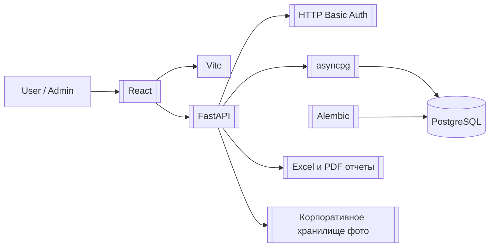

# retail-audit-kit - корпоративный аудит розницы

GitHub: `git@github.com:PavelKobe/retail-audit-kit.git`

Временная локальная копия для анализа:

```text
C:\tmp\retail-audit-kit
```

## Смысл проекта

`retail-audit-kit` - корпоративное веб-приложение для проведения, хранения и анализа чек-листов службы безопасности розничных объектов.

Проект ближе к реальному внутреннему бизнес-приложению, чем к учебному шаблону: есть роли, история проверок, конструктор шаблонов, Excel-выгрузки, KPI, фото с корпоративного хранилища и деплой под Windows Server.

## Главные связи

- Backend: [[FastAPI]], [[asyncpg]], [[PostgreSQL]], [[Alembic]]
- Frontend: [[React]], [[Vite]]
- Auth: [[HTTP Basic Auth]]
- Предметная модель: [[Checklist Templates]]
- Отчеты: [[Excel и PDF отчеты]], [[KPI отчеты]]
- Инфраструктура: [[Windows Server deployment]], [[Корпоративное хранилище фото]]

## Ключевые возможности

- авторизация по Basic Auth;
- роли `admin` и `user`;
- создание и редактирование проверок;
- история завершенных и незавершенных проверок;
- конструктор шаблонов чек-листов;
- snapshot шаблона внутри сохраненной проверки;
- статистика и отчет по нарушениям;
- Excel-экспорт;
- KPI-отчет по производительности;
- журнал действий пользователей;
- прокси фото из разрешенных корпоративных путей.

## Что читать первым

1. [[retail-audit-kit - архитектура]]
2. [[retail-audit-kit - данные и API]]
3. [[Команды retail-audit-kit]]
4. [[Деплой retail-audit-kit на Windows Server]]

## Схема высокого уровня


