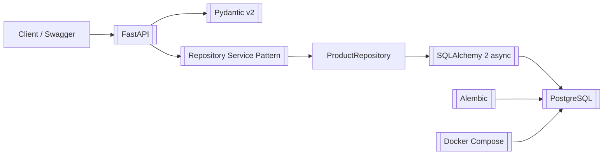

# shop-backend-course - учебный backend-стек

GitHub: `git@github.com:PavelKobe/shop-backend-course.git`

Локальный путь на рабочем ПК:

```text
C:\Users\p.kobelev\Курс_интернет магазин\shop-backend-course
```

## Смысл проекта

Это учебный проект интернет-магазина на [[FastAPI]], который постепенно собирает базовый backend-стек для новых проектов: API, база данных, миграции, доменные модели, CRUD, авторизация, админка, кеш, фоновые задачи, тесты, качество кода, мониторинг и Docker-сборка.

## Главные связи

- API: [[FastAPI]] + [[Pydantic v2]]
- База данных: [[PostgreSQL]] + [[SQLAlchemy 2 async]] + [[Alembic]]
- Архитектура кода: [[Repository Service Pattern]]
- Инфраструктура: [[Docker Compose]]
- Пользователи и безопасность: [[JWT]]
- Интерфейсы: [[Jinja2]] и [[SQLAdmin]]
- Асинхронщина и фоновые задачи: [[Redis]], [[Celery]], [[RabbitMQ]]
- Качество: [[Pytest]], [[Ruff Mypy pre-commit]]
- Прод и наблюдаемость: [[Nginx Prometheus]]

## Текущая стадия кода

В репозитории уже есть:

- приложение `app.main:app`;
- роутер `/api/v1/products`;
- проверка базы `/health/db`;
- async SQLAlchemy engine и session;
- модели `Product`, `Category`, `User`;
- слой `ProductRepository`;
- слой `ProductService`;
- Alembic-настройка с autogenerate;
- `docker-compose.yml` с PostgreSQL 16;
- `scripts/seed.py` для стартовых данных.

## Что читать первым

1. [[shop-backend-course - архитектура]]
2. [[shop-backend-course - карта модулей]]
3. [[Команды shop-backend-course]]
4. [[Диагностика PostgreSQL и health-db]]

## Быстрая схема


