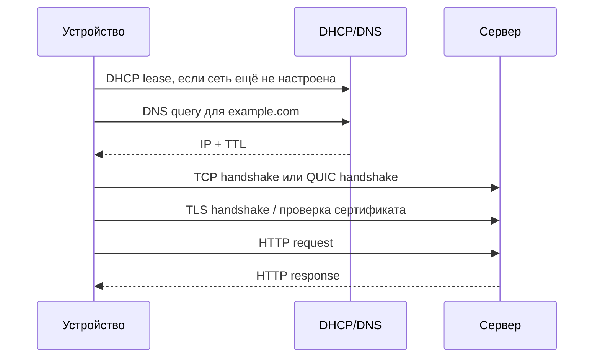

# 10 сетевых протоколов

Практическая карта протоколов, с которыми сталкивается backend-разработчик. Главная повторяющаяся форма: стороны сначала договариваются о параметрах связи или находят друг друга, а затем передают полезную нагрузку.

## Быстрая карта

| Протокол | Задача | Транспорт / порт по умолчанию | Главная особенность |
|---|---|---|---|
| HTTP / HTTPS | запросы к web/API | TCP 80/443; HTTP/3 — QUIC/UDP 443 | request → response |
| TCP | надёжный поток байтов | IP | порядок, ACK, retransmit, congestion control |
| UDP | независимые datagram | IP | минимум накладных расходов, нет гарантий доставки |
| TLS | шифрование и аутентификация канала | обычно поверх TCP; встроен в QUIC | handshake перед защищённым трафиком |
| DNS | имя → IP и другие записи | UDP/TCP 53; DoT 853; DoH через HTTPS | распределённая и кэшируемая система имён |
| DHCP | выдача сетевой конфигурации | UDP 67/68 | lease через broadcast на старте |
| SMTP | отправка электронной почты | TCP 25/465/587 | передаёт письмо вперёд между клиентом и серверами |
| IMAP | синхронизация почтового ящика | TCP 143/993 | сервер хранит источник истины |
| SSH | защищённый удалённый доступ | TCP 22 | проверка host key и шифрованные каналы |
| FTP / FTPS / SFTP | передача файлов | FTP 21; FTPS 990/21; SFTP 22 | SFTP — подсистема SSH, не «зашифрованный FTP» |

Порты — соглашения по умолчанию, а не обязательная часть протокола. Сервис можно запустить на другом порту.

## 1. HTTP и HTTPS

HTTP описывает сообщения request/response: метод, target, headers и body. Сам HTTP не хранит пользовательскую сессию между запросами; состояние добавляется через cookies, tokens, server-side sessions и приложение.

```http
GET /api/v1/orders/42 HTTP/1.1
Host: example.com
Authorization: Bearer <token>
Accept: application/json
```

HTTPS — HTTP внутри защищённого TLS-канала. TLS обеспечивает:

- шифрование содержимого;
- целостность сообщений;
- проверку сертификата сервера;
- при необходимости — клиентский сертификат.

> [!note] Версии транспорта
> HTTP/1.1 и HTTP/2 обычно работают поверх TCP + TLS. HTTP/3 работает поверх QUIC, который использует UDP и включает TLS 1.3 в свой handshake.

Связь: [[REST API]].

## 2. TCP

TCP предоставляет приложению упорядоченный надёжный поток байтов.

Установка соединения:

```text
Client                         Server
  | -------- SYN ------------> |
  | <----- SYN + ACK ---------- |
  | -------- ACK -------------> |
  |       connection ready       |
```

Sequence numbers позволяют:

- восстановить порядок сегментов;
- обнаружить потерю;
- повторно передать отсутствующие данные;
- не принять дубликат за новые данные.

TCP также управляет flow control и congestion control. Цена надёжности — handshake, состояние соединения и head-of-line blocking одного потока.

## 3. UDP

UDP отправляет отдельные datagram без установки соединения. Базовый header содержит 8 байт: source port, destination port, length и checksum.

UDP не гарантирует:

- доставку;
- порядок;
- отсутствие дубликатов;
- автоматический retransmit;
- congestion control на уровне UDP.

Это не означает, что приложение на UDP обязательно ненадёжно. DNS повторяет запрос, а QUIC самостоятельно реализует надёжность, шифрование и congestion control поверх UDP.

Применение: DNS, voice/video, игры, telemetry, QUIC.

## 4. TLS

TLS сначала согласует параметры защищённого канала, затем шифрует application data.

Упрощённый TLS 1.3 handshake:

```text
ClientHello + key share
        →
ServerHello + key share + certificate + Finished
        ←
client Finished
        →
encrypted application data
```

TLS 1.3 обычно завершает полный handshake за один round trip. Конкретный AEAD cipher выбирается при согласовании: например, AES-GCM или ChaCha20-Poly1305.

Проверка сертификата включает hostname, срок действия, цепочку доверия и назначение ключа. Отключать проверку сертификата в production нельзя.

## 5. DNS

DNS преобразует доменное имя в записи `A`, `AAAA`, `CNAME`, `MX`, `TXT` и другие.

```text
Application
  → local/stub resolver
    → recursive resolver
      → root
        → TLD (.com, .io)
          → authoritative server
```

На практике recursive resolver выполняет обход и кэширует ответ. TTL сообщает, как долго запись можно использовать без нового запроса.

Следствие: DNS failover не мгновенен. Старые записи могут оставаться в resolver и приложениях до истечения TTL, а иногда и дольше из-за дополнительных кэшей.

## 6. DHCP

DHCP автоматически выдаёт устройству IP, mask, gateway, DNS servers и срок аренды.

Классическая последовательность DORA:

```text
DISCOVER → OFFER → REQUEST → ACK
```

В начале клиент ещё не знает адрес DHCP-сервера, поэтому использует broadcast в локальном сегменте. Между подсетями сообщения передаёт DHCP relay.

## 7. SMTP

SMTP отправляет письмо от клиента к mail submission server и дальше между mail servers.

Упрощённый диалог:

```text
EHLO client.example
MAIL FROM:<sender@example.com>
RCPT TO:<recipient@example.net>
DATA
Subject: Example

Message body
.
```

Коды `2xx` означают успешное принятие команды, `4xx` — временную проблему, `5xx` — постоянную ошибку. Получение и синхронизация ящика выполняются IMAP или POP3, не SMTP.

## 8. IMAP

IMAP работает с письмами на сервере и синхронизирует папки, flags и состояние между клиентами.

Если сообщение отмечено прочитанным на телефоне, другие клиенты получают то же состояние. Это делает сервер источником истины.

POP3 ориентирован на загрузку писем клиентом. Удаление после загрузки распространено, но не обязательно: клиент может оставить копию на сервере.

## 9. SSH

SSH создаёт защищённое соединение для shell, выполнения команд, tunnels и файловых подсистем.

Этапы:

1. согласование версий и алгоритмов;
2. key exchange;
3. проверка host key сервера;
4. аутентификация пользователя;
5. открытие одного или нескольких логических channels.

Fingerprint предупреждает о неожиданном изменении host key. Причиной может быть переустановка сервера, но также man-in-the-middle атака. Предупреждение нужно проверять по доверенному каналу, а не автоматически игнорировать.

## 10. FTP, FTPS и SFTP

Это три разных решения:

| Протокол | Основа | Шифрование | Особенность |
|---|---|---|---|
| FTP | собственный протокол | нет | отдельные control и data connections |
| FTPS | FTP + TLS | да | бывает explicit и implicit |
| SFTP | подсистема SSH | да | один защищённый SSH-канал, обычно порт 22 |

SFTP не является FTP поверх TLS. FTP поверх TLS называется FTPS.

Для автоматизированной доставки файлов чаще выбирают SFTP или HTTPS/object storage API. Обычный FTP не использовать для секретных или персональных данных.

## Что происходит при открытии HTTPS-сайта



Один пользовательский запрос обычно касается нескольких протоколов, но не обязательно всех десяти.

## Общая форма: negotiation → payload

| Протокол | Согласование | Полезная нагрузка |
|---|---|---|
| TCP | three-way handshake | поток байтов |
| TLS | версии, cipher, keys, certificate | encrypted application data |
| DHCP | DORA | lease и параметры сети |
| SSH | algorithms, keys, authentication | shell, command, tunnel, SFTP |
| SMTP | greeting и envelope | message DATA |

DNS и UDP-запросы могут не иметь отдельного connection handshake, поэтому форма полезна как ментальная модель, но не как универсальный закон.

## Диагностический чек-лист

- [ ] Имя разрешается в ожидаемый IP: DNS.
- [ ] TCP/QUIC соединение устанавливается: routing, firewall, port.
- [ ] Сертификат валиден для hostname: TLS.
- [ ] HTTP status и headers соответствуют контракту.
- [ ] Timeout разделён на connect, TLS и read.
- [ ] DNS TTL учтён при failover.
- [ ] SSH host key проверен по доверенному источнику.
- [ ] Для файлов используется SFTP/FTPS/HTTPS, а не незашифрованный FTP.
- [ ] Логи не содержат tokens, passwords и полные почтовые сообщения.

## Связи

- [[REST API]]
- [[HTTP Basic Auth]]
- [[Nginx Prometheus]]
- [[Cloudflare CDN]]
- [[Windows Server deployment]]
- [[12 архитектурных концепций]]

## Источник

- [AlgoInsight — 10 Networking Protocols](https://www.instagram.com/reel/DcK-V-IAw1e/), карточка сохранена 25 августа 2026.

