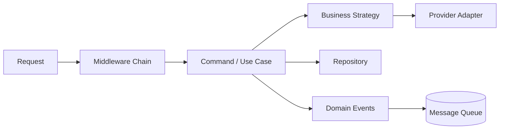

# 15 паттернов проектирования

Паттерн проектирования — это название повторяющейся проблемы и проверенной формы решения. Паттерны помогают обсуждать архитектуру, но не заменяют понимание задачи и не требуют буквального копирования классов из учебника.

> [!important] Главное правило
> Сначала должна появиться повторяющаяся проблема, затем — паттерн. Если начать с желания «применить Factory» или «добавить Singleton», решение почти всегда станет сложнее без измеримой пользы.

## Карта паттернов

| Группа | Паттерны | Главный вопрос |
|---|---|---|
| Порождающие | Singleton, Factory Method, Builder | Как создавать объекты? |
| Структурные | Adapter, Decorator, Facade, Proxy, Composite | Как соединять объекты и интерфейсы? |
| Поведенческие | Observer, Strategy, Command, Iterator, State, Template Method, Chain of Responsibility | Как распределить поведение и взаимодействие? |

## Быстрый выбор

| Ситуация | Рассмотреть |
|---|---|
| Нужен один владелец разделяемого ресурса | Singleton или, чаще, dependency container |
| Создание зависит от типа или конфигурации | Factory Method |
| Объект собирается из множества необязательных частей | Builder |
| Внешний API имеет неудобный интерфейс | Adapter |
| Нужно добавлять поведение слоями | Decorator |
| Подсистема слишком сложна для клиентов | Facade |
| Нужен контроль доступа, lazy loading или удалённый вызов | Proxy |
| Одинаково обрабатывать лист и дерево | Composite |
| Несколько получателей реагируют на событие | Observer |
| Алгоритм нужно выбирать во время выполнения | Strategy |
| Операцию нужно поставить в очередь, логировать или отменять | Command |
| Коллекцию нужно обходить без раскрытия структуры | Iterator |
| Поведение зависит от текущего состояния | State |
| Общий алгоритм имеет изменяемые шаги | Template Method |
| Запрос проходит последовательность обработчиков | Chain of Responsibility |

---

## 1. Singleton

**Задача:** гарантировать один экземпляр и предоставить к нему общий доступ.

Примеры: process-wide registry, конфигурация приложения, пул соединений, клиент метрик.

В Python отдельный Singleton-класс часто не нужен: импортируемый модуль уже создаётся один раз на процесс, а FastAPI умеет владеть ресурсами через lifespan и dependencies.

```python
# resources.py
class Resources:
    def __init__(self, db, redis):
        self.db = db
        self.redis = redis

# один экземпляр создаётся в lifespan и передаётся явно
```

**Риск:** скрытое глобальное состояние, сложные тесты, неясный lifecycle. Один экземпляр на процесс не означает один экземпляр во всём кластере.

Связь: [[FastAPI]].

## 2. Factory Method

**Задача:** отделить выбор конкретной реализации от клиента.

```python
def create_storage(kind: str) -> Storage:
    match kind:
        case "s3":
            return S3Storage()
        case "local":
            return LocalStorage()
        case _:
            raise ValueError(f"Unknown storage: {kind}")
```

Подходит для драйверов, провайдеров платежей, хранилищ и форматов экспорта.

**Риск:** фабрика превращается в огромный `if/elif`. При частом добавлении реализаций лучше registry или dependency injection.

## 3. Builder

**Задача:** поэтапно собирать сложный объект и сделать конфигурацию читаемой.

```python
query = (
    ReportQueryBuilder()
    .for_period(date_from, date_to)
    .group_by("store")
    .include_totals()
    .build()
)
```

Подходит для сложных запросов, отчётов, конфигурации и тестовых данных.

**Риск:** отдельный Builder избыточен для обычной dataclass/Pydantic-модели с именованными аргументами.

## 4. Adapter

**Задача:** привести несовместимый интерфейс к контракту приложения.

```python
class SmsSender(Protocol):
    async def send(self, phone: str, text: str) -> None: ...

class ProviderAdapter:
    def __init__(self, sdk: ExternalSmsSdk):
        self.sdk = sdk

    async def send(self, phone: str, text: str) -> None:
        await self.sdk.create_message(destination=phone, body=text)
```

Adapter изолирует код стороннего SDK и упрощает замену провайдера и тестирование.

**Риск:** пропускать через adapter все возможности SDK. Внутренний контракт должен отражать потребности приложения, а не копировать внешний API.

## 5. Decorator

**Задача:** добавить поведение объекту или функции без изменения основного кода.

```python
def audited(action: str):
    def decorate(handler):
        async def wrapped(*args, **kwargs):
            result = await handler(*args, **kwargs)
            await audit_log.write(action)
            return result
        return wrapped
    return decorate
```

Примеры: логирование, кэширование, метрики, retry и проверка прав.

**Риск:** глубокая цепочка декораторов скрывает порядок выполнения и обработку исключений. Использовать `functools.wraps` и не прятать бизнес-логику.

## 6. Facade

**Задача:** предоставить простой вход в сложную подсистему.

```python
class CheckoutFacade:
    async def checkout(self, command: CheckoutCommand) -> Order:
        await self.inventory.reserve(command.items)
        payment = await self.payments.charge(command.payment)
        return await self.orders.create(command, payment)
```

Facade удобен как application service/use case, координирующий несколько компонентов.

**Риск:** «удобный фасад» превращается в God Object. Он должен координировать, а не владеть всей предметной логикой.

## 7. Proxy

**Задача:** объект-посредник контролирует доступ к реальному объекту, сохраняя тот же интерфейс.

```python
class CachedCatalogProxy:
    def __init__(self, catalog: Catalog, cache: Cache):
        self.catalog = catalog
        self.cache = cache

    async def get(self, product_id: int) -> Product:
        if value := await self.cache.get(product_id):
            return value
        value = await self.catalog.get(product_id)
        await self.cache.set(product_id, value)
        return value
```

Варианты: virtual proxy, protection proxy, remote proxy, caching proxy.

**Риск:** proxy добавляет сетевой вызов или кэш незаметно для клиента; наблюдаемость и семантика ошибок должны оставаться понятными.

## 8. Composite

**Задача:** одинаково работать с отдельным объектом и группой объектов.

```python
class Rule(Protocol):
    def check(self, ctx: Context) -> bool: ...

class AllRules:
    def __init__(self, rules: list[Rule]):
        self.rules = rules

    def check(self, ctx: Context) -> bool:
        return all(rule.check(ctx) for rule in self.rules)
```

Примеры: дерево категорий, UI-компоненты, правила доступа, файловая система.

**Риск:** единый интерфейс становится слишком общим и разрешает бессмысленные операции для leaf-объектов.

## 9. Observer

**Задача:** уведомить несколько подписчиков об изменении или событии.

```python
class OrderEvents:
    def __init__(self, handlers: list[OrderCreatedHandler]):
        self.handlers = handlers

    async def publish(self, event: OrderCreated) -> None:
        for handler in self.handlers:
            await handler(event)
```

В одном процессе это callback/event dispatcher. Между сервисами — broker и publish–subscribe.

**Риск:** синхронный Observer связывает задержку и ошибки всех подписчиков. Для независимости нужны очередь, гарантия доставки и идемпотентные consumers.

Связи: [[RabbitMQ]], [[12 архитектурных концепций]].

## 10. Strategy

**Задача:** подменять алгоритм через общий контракт.

```python
class PricingStrategy(Protocol):
    def calculate(self, cart: Cart) -> Money: ...

strategy = strategies[customer.segment]
price = strategy.calculate(cart)
```

Примеры: расчёт скидки, маршрутизация, сортировка, выбор auth-механизма и экспорт формата.

**Риск:** создавать класс на каждую функцию. В Python strategy часто достаточно обычного callable.

## 11. Command

**Задача:** представить действие как объект с данными и единым способом выполнения.

```python
@dataclass(frozen=True)
class CreateOrder:
    user_id: int
    items: tuple[OrderItem, ...]

class CreateOrderHandler:
    async def handle(self, command: CreateOrder) -> Order:
        ...
```

Подходит для очередей задач, аудита, retry, undo и CQRS.

**Риск:** command-слой вокруг каждого CRUD создаёт церемониальность без пользы. Использовать, когда операцию действительно нужно передавать, сохранять или обрабатывать отдельно.

## 12. Iterator

**Задача:** последовательно обходить элементы без знания внутреннего устройства коллекции.

Python уже поддерживает протокол итератора и генераторы:

```python
async def iter_orders(repository, batch_size: int = 500):
    cursor = None
    while page := await repository.list_after(cursor, batch_size):
        for order in page:
            yield order
        cursor = page[-1].id
```

Примеры: потоковая обработка файлов, cursor-pagination и чтение больших выборок.

**Риск:** скрытый iterator делает N+1 запрос или удерживает соединение слишком долго.

## 13. State

**Задача:** менять допустимое поведение объекта в зависимости от состояния.

```python
TRANSITIONS = {
    "draft": {"submit": "pending"},
    "pending": {"approve": "approved", "reject": "rejected"},
    "approved": {"ship": "shipped"},
}

def transition(current: str, action: str) -> str:
    try:
        return TRANSITIONS[current][action]
    except KeyError:
        raise InvalidTransition(current, action)
```

Для простых workflow достаточно таблицы переходов. Отдельные State-классы полезны, если каждое состояние имеет много собственного поведения.

**Риск:** разбрасывать проверки `if status == ...` по controllers, services и tasks. Переходы должны иметь одного владельца.

## 14. Template Method

**Задача:** зафиксировать скелет алгоритма, оставив подклассам отдельные шаги.

```python
class Importer(ABC):
    async def run(self, file) -> ImportResult:
        rows = await self.read(file)
        validated = self.validate(rows)
        return await self.persist(validated)

    @abstractmethod
    async def read(self, file): ...
```

Примеры: импорт разных форматов, ETL, генерация отчётов.

**Риск:** наследование жёстко связывает шаги. Если порядок и состав шагов часто меняются, композиция Strategy-функций гибче.

## 15. Chain of Responsibility

**Задача:** пропустить запрос через цепочку обработчиков, каждый из которых может продолжить или остановить процесс.

```python
async def execute(request, handlers):
    for handler in handlers:
        result = await handler.handle(request)
        if result.is_terminal:
            return result
    return Continue()
```

Примеры: middleware pipeline, validation rules, moderation, обработка платежных провайдеров и fallback.

**Риск:** порядок обработчиков становится скрытой критической конфигурацией. Он должен быть явно задан и покрыт тестами.

---

## Похожие паттерны: как различать

| Пара | Разница |
|---|---|
| Adapter vs Facade | Adapter меняет интерфейс одного компонента; Facade упрощает вход в подсистему |
| Decorator vs Proxy | Decorator добавляет обязанности слоями; Proxy контролирует доступ к реальному объекту |
| Strategy vs State | Strategy выбирает алгоритм клиентом; State меняет поведение из-за внутреннего состояния |
| Command vs Strategy | Command представляет операцию и её параметры; Strategy представляет взаимозаменяемый алгоритм |
| Observer vs Chain | Observer рассылает событие многим; Chain передаёт запрос по порядку до остановки |
| Builder vs Factory | Factory выбирает, какой объект создать; Builder управляет поэтапной сборкой |

## Как паттерны сочетаются в backend



Пример оформления заказа:

1. Chain of Responsibility выполняет request ID, auth и rate limit.
2. Controller создаёт `CreateOrder` command.
3. Handler координирует сценарий как Facade.
4. Strategy выбирает правила цены и доставки.
5. Adapter изолирует API платёжного провайдера.
6. Repository сохраняет агрегат.
7. Observer публикует `OrderCreated` в очередь.

## Паттерны, уже встроенные в Python

| Возможность языка | Паттерн |
|---|---|
| модуль и import cache | простой Singleton на процесс |
| функции первого класса | Strategy, Command |
| `@decorator` | Decorator |
| generator и `yield` | Iterator |
| context manager | управление lifecycle ресурса |
| Protocol / duck typing | Adapter и Strategy без тяжёлой иерархии |
| dict из функций или классов | Factory registry |

Идиоматичный Python обычно использует функции, Protocol, dataclass и композицию раньше, чем глубокое наследование.

## Чек-лист применения

- [ ] Проблема существует в текущем коде, а не предполагается «на будущее».
- [ ] Паттерн уменьшает связанность или делает вариативность явной.
- [ ] Для команды название паттерна проясняет, а не скрывает решение.
- [ ] Более простая функция, Protocol или словарь не решают задачу лучше.
- [ ] Lifecycle и владение ресурсами остаются понятными.
- [ ] Ошибки и наблюдаемость не спрятаны за лишними слоями.
- [ ] Порядок Decorator/Chain явно протестирован.
- [ ] State-переходы и Command-обработчики имеют одного владельца.
- [ ] Adapter не позволяет внешнему SDK проникнуть во весь проект.
- [ ] Выбранный паттерн можно удалить или заменить локально.

## Связи

- [[Repository Service Pattern]]
- [[Структура backend-проекта — layers и feature slices]]
- [[FastAPI]]
- [[RabbitMQ]]
- [[Redis]]
- [[Pytest]]
- [[12 архитектурных концепций]]

## Источник

- [AlgoMaster — 15 Must-Know Design Patterns](https://www.instagram.com/reel/DapvXSDveSn/), 11 июля 2026.

