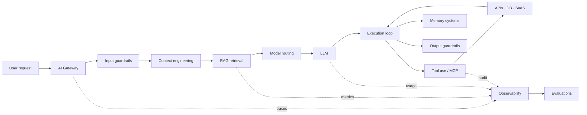

# AI -системы

AI-система — это не только модель. Production-решение включает получение контекста, выбор модели, инструменты, управление агентным циклом, память, ограничения, наблюдаемость и измерение качества.

> [!tip] Интерактивный дашборд
> [Открыть карту «17 концепций AI-систем»](ai-systems-dashboard/index.html)
>
> Доступны фильтры по пяти слоям, поиск, раскрытие каждой карточки и архитектурные сценарии: RAG-ассистент, tool-агент, оптимизация стоимости и trust/evals.

> [!summary] Пять слоёв AI-системы
> **Retrieval** находит правильный контекст → **Efficiency** выбирает экономичный путь → **Capability** подключает действия и данные → **Autonomy** управляет многошаговой работой → **Trust** ограничивает, наблюдает и измеряет результат.

## Навигатор по AI-инструментам

- [[AI-инструменты без VPN — карта на 2026-08-12]] — датированная подборка инструментов по задачам с отдельным интерактивным дашбордом.
- [[Graph Engineering для AI-агентов]] — переход от последовательного loop к типизированному параллельному workflow.
- [[12 сценариев Claude]] — практическая карта разработки, знаний, автоматизации, карьеры и создания материалов.

## Карта 17 концепций

| Слой | Концепции | Системный вопрос |
|---|---|---|
| Retrieval | Embedding Models, Vector Databases, RAG, Context Engineering | Как дать модели нужные знания в нужной форме? |
| Efficiency | Semantic Caching, Model Routing, AI Gateways | Как контролировать latency, стоимость и доступность? |
| Capability | Function Calling, Tool Use, MCP, External Integrations | Как безопасно читать данные и выполнять действия? |
| Autonomy | Agent Harness, Execution Loop, Memory Systems | Как управлять многошаговой работой и остановкой? |
| Trust | Guardrails, Observability, Evaluations | Как снизить риск и доказать качество? |

## Референсная архитектура



Не каждый продукт требует все 17 компонентов. Начинать следует с минимальной проверяемой цепочки и добавлять слой после появления конкретного риска или ограничения.

---

# Retrieval

## 1. Embedding Models

Embedding model превращает текст, изображение или другой объект в числовой вектор, где близость должна отражать полезную для задачи семантическую схожесть.

```text
document → embedding model → [0.13, -0.48, ...]
query    → embedding model → [0.11, -0.44, ...]
                              ↓ similarity
```

Что проектировать:

- единая модель и версия для индекса и запросов;
- chunking до embedding;
- normalization и выбранная distance metric;
- мультиязычность и предметная область;
- batch generation и стоимость переиндексации.

Типичный отказ: embedding хорошо отражает общую тему, но плохо различает документы, важные для конкретного бизнес-вопроса.

Проверка: retrieval dataset из реальных queries с известными релевантными documents; метрики Recall@k, Precision@k, MRR или nDCG.

## 2. Vector Databases

Vector database или vector index хранит embeddings и выполняет approximate nearest-neighbor search.

Обычно запись содержит:

```json
{
  "id": "chunk-42",
  "vector": [0.13, -0.48],
  "text": "...",
  "metadata": {
    "tenant_id": "acme",
    "document_id": "policy-v3",
    "version": 3
  }
}
```

Важные решения:

- индекс: HNSW, IVF или другой ANN-подход;
- distance metric: cosine, dot product, Euclidean;
- metadata filters и tenant isolation;
- стратегия update/delete;
- hybrid search: dense + keyword/BM25;
- reranking после первичного поиска.

Типичный отказ: похожие vectors возвращаются правильно, но фильтр допускает документ другого клиента или устаревшую версию.

Vector search можно начать с расширения основной БД, например `pgvector`, если масштаб и latency не требуют отдельной системы.

## 3. RAG

Retrieval-Augmented Generation добавляет в запрос модели найденные внешние документы.

```text
query
  → rewrite / classify
    → retrieve
      → filter / rerank
        → assemble context
          → generate answer with citations
```

RAG состоит минимум из двух независимых задач:

1. **Retrieval:** найден ли правильный контекст?
2. **Generation:** использовала ли модель контекст корректно?

Диагностика уверенного неправильного ответа:

| Проверка | Если не прошла | Исправлять |
|---|---|---|
| Нужный документ попал в top-k? | нет | chunking, query rewrite, embeddings, hybrid search |
| Нужный chunk пережил filters/rerank? | нет | metadata, reranker, score thresholds |
| Контекст поместился и не конфликтует? | нет | context assembly, deduplication, versioning |
| Ответ подтверждается контекстом? | нет | prompt, citation requirement, abstention, model |

Не обвинять модель, пока retrieval и assembly не измерены отдельно.

RAG — плохой выбор, если знания малы и стабильны, достаточно обычного search/API, либо задача требует точной детерминированной выборки из структурированной БД.

## 4. Context Engineering

Context engineering управляет всем, что модель видит в конкретном вызове:

- system/developer instructions;
- user request;
- retrieved documents;
- tool schemas и результаты;
- conversation summary;
- short-term memory;
- примеры формата;
- budget и порядок блоков.

Хороший context:

- минимален, но достаточен;
- отделяет trusted instructions от untrusted content;
- содержит свежие и непротиворечивые данные;
- явно сообщает ограничения и expected output;
- не дублирует большие документы без необходимости.

Типичный отказ: нужный факт находится в окне контекста, но теряется среди длинных logs, повторов и конфликтующих инструкций.

---

# Efficiency

## 5. Semantic Caching

Semantic cache повторно использует ответ для нового запроса, который близок по смыслу, а не обязательно совпадает строка в строку.

```text
query → embedding → nearest cached query
                    ├── score ≥ threshold → HIT
                    └── score < threshold → MISS → model → cache
```

В cache key должны участвовать не только query:

- tenant/user scope;
- model и версия prompt;
- права доступа;
- версия данных;
- locale;
- параметры генерации;
- tool availability.

Риски: неправильный semantic hit, устаревший ответ, утечка между tenants, кэширование персональных данных и poisoning.

Не применять к быстро меняющимся данным, high-stakes ответам без повторной проверки и действиям с side effects.

Связь: [[Redis]].

## 6. Model Routing

Model router выбирает модель или путь обработки для конкретного запроса.

Сигналы маршрутизации:

- сложность и тип задачи;
- требуемая modality;
- latency SLO;
- стоимость;
- размер context;
- регион и data residency;
- tool/function support;
- текущая доступность и rate limits;
- risk class.

```text
simple classification → small/cheap model
code migration        → coding-capable model
vision document       → multimodal model
provider outage       → approved fallback
```

Проверять router на task-level качестве, а не только на средней стоимости. Дешёвый route, который увеличивает retries и ручные исправления, может быть дороже.

Связь: [[OpenRouter]].

## 7. AI Gateways

AI gateway — единая техническая граница между приложениями и model providers.

Типичные функции:

- authentication и quotas;
- provider abstraction;
- routing и fallback;
- rate limiting;
- request/response logging с redaction;
- token/cost accounting;
- policy enforcement;
- tracing;
- caching;
- circuit breaker.

Риск централизации: gateway становится bottleneck и единой точкой отказа, а бизнес-логика незаметно переезжает в инфраструктурный слой.

Gateway не должен скрывать различия моделей, важные для качества, безопасности и поведения tools.

---

# Capability

## 8. Function Calling

Function calling позволяет модели сформировать структурированный запрос к заранее описанной функции.

```json
{
  "name": "get_order",
  "arguments": {
    "order_id": 42
  }
}
```

Модель предлагает вызов, но приложение остаётся владельцем выполнения.

Обязательная граница:

```text
model output
  → schema validation
    → authorization
      → policy / confirmation
        → execute
          → sanitize result
            → return observation to model
```

Типичный отказ: JSON формально валиден, но `order_id` принадлежит другому пользователю. Проверка schema не заменяет authorization.

## 9. Tool Use

Tool use — полный lifecycle использования инструмента: выбор, аргументы, выполнение, observation, обработка ошибки и следующий шаг.

Function calling — один из способов описать tool call. Tool use шире и включает:

- discovery доступных tools;
- выбор безопасного действия;
- timeout, retry и idempotency;
- side-effect classification;
- подтверждение человека;
- audit log;
- преобразование результата в ограниченный контекст.

Данные из tool считаются недоверенными, особенно web pages, emails и загруженные документы. Они не могут самостоятельно расширять полномочия агента.

## 10. MCP

Model Context Protocol стандартизирует подключение AI-host к tools и resources внешней системы.

```text
AI host / client
      ↓ MCP
MCP server
      ↓
API · database · filesystem · SaaS
```

Преимущества:

- единый protocol вместо отдельной интеграции для каждого клиента;
- discoverable tools/resources;
- переиспользуемая серверная граница;
- разделение model runtime и системы-владельца данных.

Что MCP не решает автоматически: authentication, authorization, tenant isolation, secret management, business validation и безопасность side effects.

Связь: [[Claude — карта возможностей]].

## 11. External Integrations

External integration — конкретная связь с API, database, filesystem, queue или SaaS.

Для каждой интеграции определить:

- владельца и contract;
- read/write capabilities;
- authentication и scopes;
- timeout, retry и rate limits;
- idempotency;
- pagination;
- schema/versioning;
- audit и data retention;
- degradation при недоступности.

Не отдавать модели универсальный HTTP-клиент с произвольным URL, если достаточно нескольких узких domain tools.

---

# Autonomy

## 12. Agent Harness

Agent harness — управляемая система вокруг модели, которая задаёт среду выполнения:

- instructions и контекст;
- tools и permissions;
- execution loop;
- state и memory;
- budgets;
- sandbox;
- checks/evals;
- telemetry;
- human approval;
- termination conditions.

Модель предлагает действия, harness ограничивает и проверяет их.

```text
goal + context + policies
  → model decision
    → validated action
      → environment
        → observation
          → checks / next step / stop
```

Связь: [[Harness Engineering — универсальный чек-лист разработки приложений]].

## 13. Execution Loop

Базовый агентный цикл:

```text
perceive → reason/plan → act → observe → update state → repeat or stop
```

Цикл обязан иметь termination conditions:

- цель достигнута и проверена;
- исчерпан max steps;
- превышен time/token/cost budget;
- повторяется одно состояние;
- инструмент стабильно возвращает одну ошибку;
- требуется новое разрешение или решение человека;
- риск выше допустимого.

Признаки зацикливания:

- одинаковые tool calls без нового observation;
- план переписывается, но состояние не меняется;
- ошибка не классифицируется;
- retries не имеют backoff и предела;
- агент оптимизирует proxy-метрику вместо цели.

Автономность без условия остановки — неконтролируемый цикл расходов и действий.

## 14. Memory Systems

Memory сохраняет информацию между шагами или сессиями.

| Вид | Что хранит | Срок жизни |
|---|---|---|
| Working memory | текущая цель, plan, observations | один execution loop |
| Conversation summary | решения и открытые вопросы | между context compactions |
| Episodic memory | события прошлых запусков | ограниченный период |
| Semantic memory | устойчивые факты и знания | до изменения источника истины |
| Procedural memory | проверенные способы работы | версия workflow/skill |

Для каждой памяти нужны:

- правило записи;
- источник и timestamp;
- владелец;
- retrieval policy;
- TTL/удаление;
- tenant isolation;
- способ исправления неверного факта.

Memory не должна становиться бесконтрольным скрытым источником истины. Актуальные данные лучше читать из authoritative system через tool.

---

# Trust

## 15. Guardrails

Guardrails — набор ограничений до, во время и после model call.

Слои защиты:

1. input validation и content classification;
2. разграничение trusted instructions и untrusted data;
3. tool allowlist и минимальные permissions;
4. structured output schema;
5. domain/business validation;
6. output moderation и data-loss prevention;
7. human approval для опасных side effects;
8. rate/cost/time limits;
9. audit log и kill switch.

Один prompt «не делай опасного» не является guardrail. Критические ограничения должны быть детерминированными и находиться вне модели.

## 16. Observability

Observability позволяет восстановить, что произошло в системе, без записи скрытых рассуждений модели.

Минимальная trace-модель:

```text
request
  ├── retrieval query / document IDs / scores
  ├── prompt template version / context size
  ├── model / latency / token usage / cost
  ├── tool name / sanitized args / result status
  ├── guardrail decisions
  └── final result / user feedback / error class
```

Что измерять:

- latency по этапам;
- success/error/timeout rate;
- tokens и стоимость;
- retrieval quality;
- cache hit rate;
- route distribution;
- tool success и retries;
- loop steps и termination reason;
- guardrail blocks;
- пользовательские исправления.

Не логировать secrets, полные tokens, лишние персональные данные и необработанное содержимое документов без законного основания.

## 17. Evaluations

Evaluation сравнивает поведение AI-системы с заданным критерием.

```text
dataset → run candidate → score → compare baseline → inspect failures → decide
```

Уровни evals:

| Уровень | Пример метрики |
|---|---|
| Retrieval | Recall@k, MRR, nDCG, context precision |
| Generation | factuality, groundedness, completeness, format |
| Tools | correct tool, valid args, task success, side-effect safety |
| Agent | goal completion, steps, cost, termination correctness |
| Product | пользовательский success rate, ручные исправления, business KPI |

Хороший evaluation набор:

- построен из реальных сценариев и отказов;
- содержит normal, edge и adversarial cases;
- версионируется;
- имеет baseline;
- разделяет automatic scores и human review;
- запускается до и после изменения;
- показывает сегменты, а не только среднее значение.

LLM-as-a-judge полезен, но сам требует rubric, calibration, проверяемых примеров и контроля bias. «Стало ощущаться лучше» — не evaluation.

---

## Пять главных диагностических вопросов

### Retrieval

**Симптом:** RAG отвечает правдоподобно, но неверно.

Сначала проверить, найден ли нужный документ и попал ли он в final context. Retrieval failure и generation failure — разные классы проблем.

### Efficiency

**Симптом:** счёт за inference вырос втрое.

Разложить стоимость по feature, model, route, tokens, retries и cache misses. Оптимизация начинается с архитектуры запросов, а не только с переговоров о цене provider.

### Capability

**Симптом:** модель вызвала delete API с неправильным ID.

Исправление находится на execution boundary: schema validation, object-level authorization, confirmation и idempotency. Model output — недоверенный input.

### Autonomy

**Симптом:** агент сделал 40 шагов и ходит по кругу.

Проверить termination conditions, state-change detector, budgets, retry policy и возможность запросить помощь человека.

### Trust

**Симптом:** команда утверждает, что новая версия «лучше».

Попросить dataset, baseline, scoring method, confidence/variance, failure segments и связь с product metric.

## Когда популярные решения не нужны

| Решение | Когда это плохой выбор |
|---|---|
| RAG | достаточно точного SQL/API запроса или знаний мало и они стабильны |
| Vector DB | объём мал, metadata search важнее, обычная БД покрывает latency |
| Agent | workflow известен заранее и лучше выражается детерминированным pipeline |
| Long-term memory | факты уже хранятся в authoritative system и должны читаться свежими |
| Model routing | одна модель покрывает объём, а сложность router не окупается |
| Semantic cache | ответы персональны, быстро устаревают или высокорисковые |
| MCP server | нужна одна простая внутренняя интеграция без нескольких AI-клиентов |

Инженерная зрелость проявляется не в знании терминов, а в способности объяснить, когда компонент не нужен.

## Порядок построения production AI-функции

1. Определить пользовательскую задачу и наблюдаемый success criterion.
2. Собрать небольшой golden dataset и baseline до сложной архитектуры.
3. Реализовать простой model call со structured output.
4. Добавить retrieval только если модели нужны внешние знания.
5. Измерить retrieval и generation отдельно.
6. Подключить узкие read-only tools с schema validation.
7. Добавить write tools только с authorization и confirmation.
8. Ввести traces, cost accounting и error taxonomy.
9. Добавить cache/routing после измерения latency и стоимости.
10. Строить execution loop только для задач, где шаги нельзя определить заранее.
11. Ограничить loop budgets и termination conditions.
12. Добавить memory только с правилами записи, чтения и удаления.
13. Запустить offline evals и ограниченный online rollout.
14. Сравнить с baseline и разобрать failures по сегментам.

## Production-чек-лист

### Retrieval

- [ ] Embedding model и index version зафиксированы.
- [ ] Есть evaluation dataset для retrieval.
- [ ] Metadata filters обеспечивают tenant isolation.
- [ ] Измеряются retrieval и generation failures отдельно.
- [ ] Документы имеют source, version и timestamp.

### Models и стоимость

- [ ] Записываются model, tokens, latency и cost на feature.
- [ ] Routing проверен по качеству каждого класса задач.
- [ ] Fallback не нарушает data policy и capabilities.
- [ ] Cache key учитывает tenant, permissions и версии.

### Tools и агенты

- [ ] Model output валидируется как недоверенный input.
- [ ] Object-level authorization выполняется перед action.
- [ ] Side effects идемпотентны или защищены от повтора.
- [ ] Dangerous actions требуют подтверждения человека.
- [ ] Execution loop имеет max steps/time/cost и stop reasons.
- [ ] Memory имеет TTL, provenance и способ удаления.

### Trust

- [ ] Guardrails реализованы вне prompt для критических ограничений.
- [ ] Trace связывает retrieval, model, tools и final result.
- [ ] Логи не содержат secrets и лишние персональные данные.
- [ ] Golden set содержит реальные, edge и adversarial cases.
- [ ] Есть baseline и критерий release/block.
- [ ] Online feedback не заменяет offline evals.

## Связи

- [[Harness Engineering — универсальный чек-лист разработки приложений]]
- [[Claude — карта возможностей]]
- [[Claude Code — структура AI-assisted проекта]]
- [[OpenRouter]]
- [[AIHub]]
- [[Redis]]
- [[PostgreSQL]]
- [[REST API]]
- [[12 архитектурных концепций]]

## Источник

- [Brij Kishore Pandey — Top 17 AI System Concepts](https://www.instagram.com/p/DcY30ckOOQ6/), 23 августа 2026.
