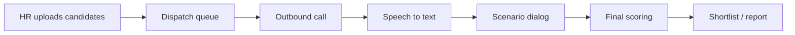

# AI Voice Screening

AI Voice Screening - автоматический первичный обзвон кандидатов с записью, расшифровкой, оценкой и передачей результата HR.

## Где используется

- [[VoiceScreen - голосовой AI-скрининг]]

## Типовой поток

## Важные части

- телефония: [[Voximplant]];
- распознавание и синтез речи: [[Yandex SpeechKit]];
- сценарий вопросов: YAML/DB сценарии;
- финальная оценка: [[OpenRouter]];
- записи звонков: [[Yandex Object Storage]];
- фоновые задачи: [[Celery]] + [[Redis]].
