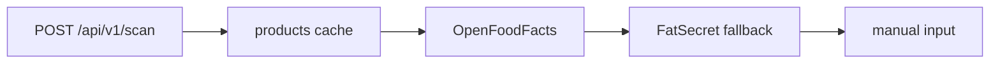

# Barcode Scanner

Barcode Scanner - сканер штрихкодов продуктов в NutryAI для быстрого добавления еды и пользовательских продуктов.

## Где используется

- [[NutryAI - ИИ-дневник питания]]

## Файлы проекта

- `app/web/src/components/products/BarcodeScanner.tsx`
- `app/backend/routers/scan.py`
- `app/backend/models/products.py`
- `app/backend/models/user_products.py`
- `MEMORY_BANK.md`

## Frontend

Используется `@zxing/browser` + `@zxing/library`.

Паттерны из памяти проекта:

- `BrowserMultiFormatReader`;
- hints: `TRY_HARDER`;
- форматы: EAN-13, EAN-8, UPC-A, UPC-E, CODE-128;
- для iOS viewport должен быть видимым до инициализации ZXing.

## Backend lookup chain

## Gotchas

- Российские PLU-коды 4-5 цифр обычно не находятся во внешних базах.
- На цилиндрических банках камера читает хуже; нужен ручной fallback.
- FatSecret работает только при `FATSECRET_CLIENT_ID` и `FATSECRET_CLIENT_SECRET`.

## Связи

- [[NutryAI - данные и API]]
