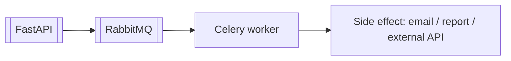

# Celery

Celery выполняет фоновые задачи вне HTTP-запроса.

## В курсе

Модуль M12: Celery + [[RabbitMQ]] для фоновых задач, например писем о заказах.

## Поток

## Связи

- [[RabbitMQ]]
- [[Redis]]
- [[Docker Compose]]
- [[FastAPI]]
