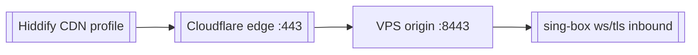

# Cloudflare CDN

Cloudflare CDN в Antygraviti MVP используется как запасной путь для VLESS-профиля, когда прямой Reality-профиль по IP режется DPI.

## Где используется

- [[Antygraviti MVP - Gatekeeper VPN Orchestrator]]
- [[Эксплуатация Antygraviti MVP]]

## Идея

Клиент подключается к домену на Cloudflare, а Cloudflare проксирует трафик на origin-порт VPS. Для DPI это выглядит как обычный TLS-трафик к Cloudflare.

## Поток

## Файлы проекта

- `backend/src/handlers/key-links.ts`
- `backend/src/orchestrator/ssh-deployer.ts`
- `backend/src/apply-cdn.ts`
- `backend/src/check-cdn-logs.ts`

## Важные параметры

- domain, например `vless.cedarnotes.com`;
- origin port, например `8443`;
- WebSocket path;
- Cloudflare Origin certificate;
- transport type: `ws` или `httpupgrade`.

## Связи

- [[VLESS Reality]]
- [[sing-box]]
- [[Hiddify]]
