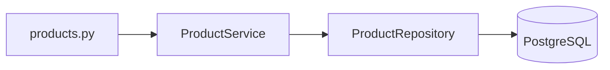

# Repository Service Pattern

Паттерн разделяет HTTP, бизнес-логику и доступ к данным.

## В проекте

## Router

`app/api/v1/products.py` принимает HTTP-запросы и возвращает HTTP-ответы.

## Service

`app/services/product.py` содержит бизнес-логику: проверка slug, исключения, update/delete.

## Repository

`app/repositories/product.py` содержит SQLAlchemy-запросы.

## Почему это полезно

- API не смешивается с SQL.
- Бизнес-логика не размазана по роутам.
- Тестировать проще.
- Новые сущности можно добавлять по тому же шаблону.

## Связи

- [[FastAPI]]
- [[SQLAlchemy 2 async]]
- [[PostgreSQL]]
- [[Pytest]]
