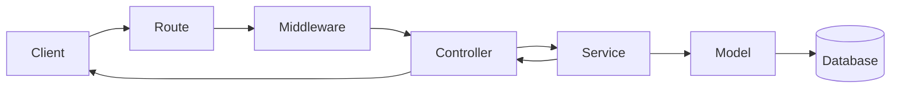

# Структура backend-проекта — layers и feature slices

Структура каталогов должна показывать границы ответственности и помогать разработчику быстро находить путь запроса. Классическая послойная схема хорошо подходит для небольшого backend, но при росте количества предметных модулей её лучше преобразовать в feature-based или vertical-slice структуру.

## Классическая послойная структура

Вариант из исходного ролика для Node.js/Express:

```text
backend/
├── src/
│   ├── config/          # окружение, БД и системные настройки
│   ├── controllers/     # преобразование request/response
│   ├── middlewares/     # auth, validation, logging
│   ├── models/          # структура данных и модели БД
│   ├── routes/          # HTTP endpoint и привязка controller
│   ├── services/        # бизнес-логика и интеграции
│   └── utils/           # общие небольшие функции
├── tests/
│   ├── unit/
│   └── integration/
├── .env
├── .gitignore
├── package.json
├── server.js
└── Dockerfile
```

Путь одного запроса:



## Ответственность слоёв

### `config/`

Содержит конфигурацию окружения и создание инфраструктурных клиентов:

- загрузка и валидация environment variables;
- настройки БД, Redis, очереди и внешних API;
- параметры логирования;
- разделение dev/test/production конфигурации.

Конфигурация не должна содержать бизнес-логику или открытые секреты.

### `routes/`

Объявляет внешний HTTP-контракт:

- метод и URL;
- middleware для endpoint;
- controller/handler;
- документацию и версию API.

```javascript
router.post('/orders', authenticate, validate(createOrderSchema), createOrder)
```

Route не рассчитывает цену заказа и не делает SQL-запросы.

### `controllers/`

Адаптирует HTTP к бизнес-операции:

1. получает уже проверенные входные данные;
2. вызывает service/use case;
3. преобразует результат в HTTP response;
4. сопоставляет доменные ошибки со статусами API.

Controller должен быть коротким. Если его трудно тестировать без HTTP, бизнес-логика, вероятно, находится не в том слое.

### `services/`

Содержит сценарии и бизнес-правила:

- создание заказа;
- расчёт цены;
- проверка допустимого перехода статуса;
- координация repository и внешних интеграций;
- границы транзакций.

Service не должен зависеть от Express `Request`/`Response` или FastAPI `Depends`.

### `models/`

В простом проекте здесь лежат ORM-модели. При росте полезно разделить:

```text
domain/           # предметные сущности и правила
schemas/          # API input/output
repositories/     # доступ к данным
db/models/        # ORM-модели
```

API-схема, доменная сущность и строка БД — разные представления. Их автоматическое объединение ускоряет старт, но создаёт связанность и риск утечки внутренних полей.

### `middlewares/`

Обрабатывает общие транспортные задачи до или после controller:

- authentication;
- request ID и tracing;
- access log;
- CORS;
- rate limiting;
- единый error handler.

Проверку прав на конкретный заказ или документ лучше выполнять внутри use case/service, где доступен предметный контекст.

### `utils/`

Каталог только для небольших действительно общих функций. Имя `utils` не должно становиться местом для кода без владельца.

Плохо:

```text
utils/order.js
utils/payment.js
utils/user.js
```

Это уже предметные модули, а не общие helpers.

### `tests/`

- `unit/` проверяет чистые правила, services и небольшие функции без реальной инфраструктуры;
- `integration/` проверяет БД, очередь, HTTP-контракт и границы компонентов;
- `e2e/` проверяет важный пользовательский сценарий через собранную систему.

## Когда структура по слоям работает хорошо

- До 5–10 предметных сущностей.
- Команда небольшая и backend — один deployable service.
- Большинство операций укладывается в одинаковый CRUD-путь.
- Файлы слоёв остаются компактными.
- Разработчик может проследить feature, открыв несколько очевидных файлов.

## Главная проблема при росте

При 50 предметных модулях каталоги превращаются в длинные списки:

```text
controllers/  # 50+ файлов
services/     # 50+ файлов
models/       # 50+ файлов
routes/       # 50+ файлов
```

Один feature оказывается размазан по всему репозиторию. Изменение `orders` требует постоянно переключаться между далёкими каталогами, а границы модулей существуют только в именах файлов.

## Feature-based / vertical-slice структура

Когда проект растёт, код удобнее группировать по предметной области:

```text
src/
├── modules/
│   ├── orders/
│   │   ├── routes.ts
│   │   ├── controller.ts
│   │   ├── service.ts
│   │   ├── repository.ts
│   │   ├── model.ts
│   │   ├── schemas.ts
│   │   └── tests/
│   ├── users/
│   └── payments/
├── infrastructure/
│   ├── database/
│   ├── cache/
│   └── messaging/
├── shared/
│   ├── auth/
│   ├── errors/
│   └── observability/
└── app.ts
```

Преимущества:

- весь код feature расположен рядом;
- границы модулей видны в файловой системе;
- проще назначать владельцев и удалять feature;
- меньше соблазна связывать модули через общие service-файлы;
- тесты находятся рядом с поведением.

Недостатки:

- внутри каждого модуля повторяется одинаковая структура;
- shared-код требует строгих правил;
- cross-module операции нуждаются в application layer или событиях;
- для маленького CRUD это может быть избыточно.

## Вариант для FastAPI

Для проектов базы знаний удобен следующий компромисс:

```text
app/
├── main.py
├── core/
│   ├── config.py
│   ├── security.py
│   └── errors.py
├── infrastructure/
│   ├── db/
│   ├── redis/
│   └── messaging/
├── modules/
│   ├── orders/
│   │   ├── router.py
│   │   ├── schemas.py
│   │   ├── service.py
│   │   ├── repository.py
│   │   ├── models.py
│   │   └── exceptions.py
│   └── users/
└── shared/
    ├── pagination.py
    └── types.py

tests/
├── unit/
├── integration/
└── e2e/
```

Путь зависимости:

```text
router → service → repository → database
```

Обратное направление запрещено: repository не импортирует router или service, а domain/service не зависит от HTTP-объектов FastAPI.

## Layered или feature-based

| Критерий | Layered | Feature-based |
|---|---|---|
| Маленький CRUD | проще | часто избыточно |
| Много предметных модулей | навигация ухудшается | код feature собран рядом |
| Единообразие технических слоёв | хорошо видно | повторяется внутри модулей |
| Владение командой | слои делят ответственность | команда владеет feature целиком |
| Удаление feature | затрагивает много каталогов | локализовано в одном модуле |
| Cross-feature логика | легко превратить в общий service | требует явной координации |

Необязательно выбирать один вариант навсегда. Нормальная эволюция:

```text
маленький проект
  → простые layers
    → modules с внутренними layers
      → отдельные сервисы только при независимом масштабировании или владении
```

## Чек-лист структуры проекта

- [ ] По дереву каталогов понятны предметные области.
- [ ] HTTP-слой не содержит SQL и бизнес-правил.
- [ ] Service не зависит от объектов конкретного web-фреймворка.
- [ ] ORM-модели не используются как публичный API-контракт без явного решения.
- [ ] Middleware содержит только сквозную транспортную логику.
- [ ] `utils/` не стал складом предметного кода.
- [ ] Конфигурация валидируется при старте.
- [ ] Настоящие `.env` и секреты не попадают в Git.
- [ ] Unit, integration и e2e тесты разделены по назначению.
- [ ] Для нового feature понятно, в какой каталог добавлять каждый файл.
- [ ] Импорты соблюдают направление зависимостей.
- [ ] Структура может быть объяснена без фразы «мы всегда так делали».

## Практический вывод

Хорошая структура не обязана называться Clean Architecture, DDD, CQRS или Hexagonal. Она должна делать зависимости явными, локализовать изменения и соответствовать размеру системы. Сначала выбирают минимальную структуру, которая защищает реальные границы, а усложняют её после появления измеримой боли.

## Связи

- [[Repository Service Pattern]]
- [[FastAPI]]
- [[REST API]]
- [[Pydantic v2]]
- [[SQLAlchemy 2 async]]
- [[Pytest]]
- [[Docker Compose]]
- [[Claude Code — структура AI-assisted проекта]]

## Источник

- [Smart Coder Hacker — Backend Folder Structure & Use](https://www.instagram.com/reel/DbXY3sgT7dh/), 28 июля 2026.

