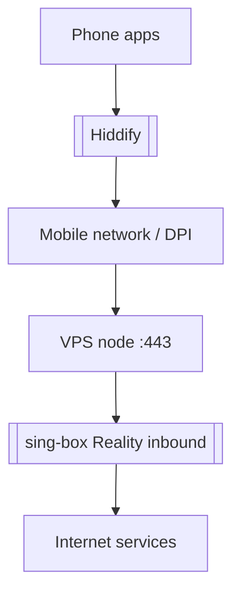
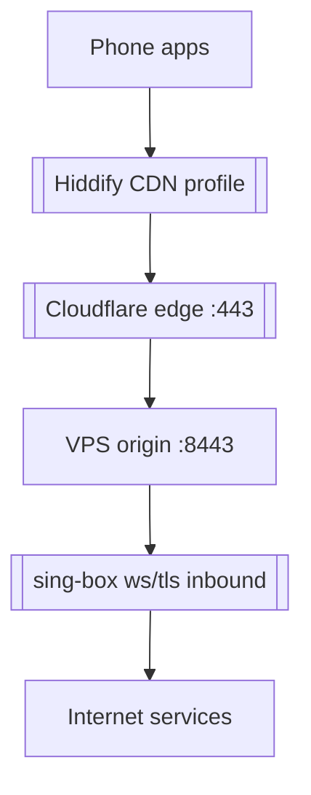

# Эксплуатация Antygraviti MVP

Связанный проект: [[Antygraviti MVP - Gatekeeper VPN Orchestrator]].

Источник в проекте: `docs/ops-memo.md`.

## Платные сервисы

| Сервис | За что отвечает | Если отвалится |
|---|---|---|
| [[Aeza VPS]] | VPS-нода с sing-box | VPN у пользователей падает |
| [[Yandex Cloud Serverless]] | Function, API Gateway, Object Storage, Lockbox | Личный кабинет, auth и выдача ключей встают |
| [[Yandex Database YDB]] | users, subscriptions, servers, vpn_keys | Бэкенд не сможет авторизовать и управлять ключами |
| Porkbun | домен `cedarnotes.com` | CDN-fallback отвалится, Reality может продолжить работать |
| [[Cloudflare CDN]] | DNS/CDN proxy для `vless.cedarnotes.com` | CDN-профиль перестанет работать |
| [[YooKassa]] | прием оплат | новые оплаты/подписки не будут обрабатываться |

По `docs/ops-memo.md`: Aeza shared-нода была продлена 2026-05-30 примерно до 2027-05-30. Перед действиями с оплатой лучше перепроверять в личном кабинете провайдера.

## Инвентарь

- YC Function: `gatekeeper-backend-fn`
- API Gateway: `gatekeeper-gateway`
- YDB: `gatekeeper-db`
- Object Storage bucket: `gatekeeper-frontend-bucket`
- Lockbox: `gatekeeper-secrets`
- Домен: `cedarnotes.com`
- CDN host: `vless.cedarnotes.com`

## Traffic path

### Основной путь Reality



### Запасной путь CDN



## Клиентская настройка

Главная инструкция: `docs/client-setup.md`.

Ключевые настройки Hiddify:

- включить TLS fragmentation;
- IPv6 route выключить;
- TUN implementation выбрать `system`;
- в Telegram выключить встроенный proxy;
- если timeout, попробовать подключение 2-3 раза или переключить сеть.

## Операционные проверки

```powershell
cd C:\Users\kobel\Project_Antygraviti\mvp_new\backend
npx ts-node src/check-cdn-logs.ts
npx ts-node src/check-node-config.ts
npx ts-node src/check-node-health.ts
npx ts-node src/check-subscription-links.ts
```

## Что помнить

- IPRoyal/residential upstream по заметке `ops-memo.md` не используется; перед оплатой проверить актуальность.
- `servers.config_data` чувствителен: там root-пароль, privateKey, shortId, CDN/routing.
- Если provisioning падает после заказа VPS, код пытается удалить осиротевший сервер через Aeza API; при ошибке cleanup нужно вручную проверить панель Aeza.
