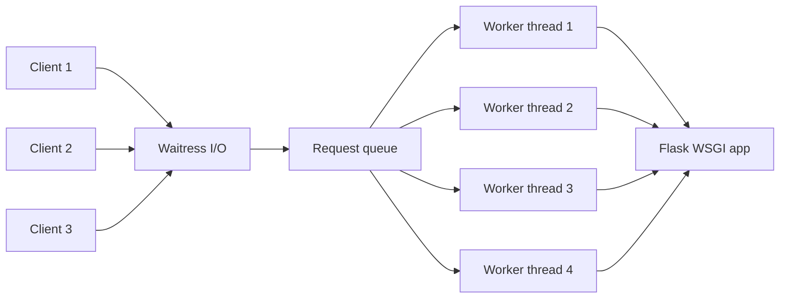
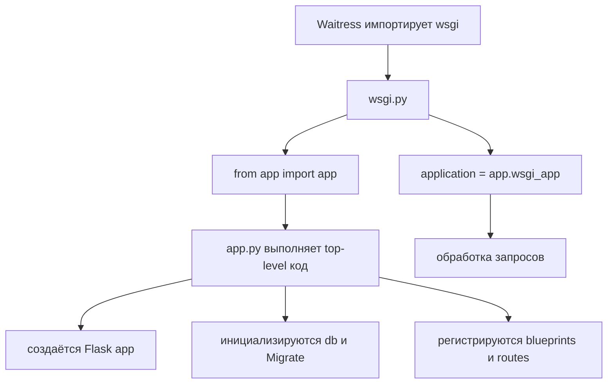

# M00.0 — Как Python исполняет Flask-приложение

## Цель

Построить фундаментальную модель от файла с кодом до обработки HTTP-запроса:

```text
исходный код → интерпретатор CPython → процесс → потоки → WSGI-сервер → Flask → view function → ответ
```

Материал привязан к реальным файлам вашего приложения:

- `C:\Users\p.kobelev\Documents\001Обучение\app.py`;
- `C:\Users\p.kobelev\Documents\001Обучение\app_factory.py`;
- `C:\Users\p.kobelev\Documents\001Обучение\wsgi.py`.

Исходные файлы не изменяются. Мы используем их как рабочий пример.

---

# Часть A. Как Python выполняет файл

## 1. Python как язык и CPython как реализация

Python — язык программирования: его синтаксис и правила.

CPython — основная реализация Python, написанная преимущественно на C. Команда `python` или `py` на обычной Windows-машине чаще всего запускает именно CPython.

Упрощённый путь:

```text
текст .py
  ↓
разбор синтаксиса
  ↓
AST — дерево программы
  ↓
bytecode — инструкции виртуальной машины Python
  ↓
цикл выполнения CPython
```

### AST

AST, abstract syntax tree — структурное представление программы. Например, присваивание, вызов функции и условие становятся узлами дерева, а не остаются строками текста.

### Bytecode

Bytecode — набор инструкций виртуальной машины CPython. Это не машинный код процессора.

Посмотреть bytecode небольшой функции можно стандартным модулем `dis`:

```python
import dis


def add(left: int, right: int) -> int:
    return left + right


dis.dis(add)
```

Для backend-разработчика не нужно запоминать инструкции bytecode. Важно понимать: CPython исполняет функции через собственную виртуальную машину, а не передаёт текст Python напрямую процессору.

## 2. Process — процесс

Когда операционная система запускает Python-приложение, она создаёт process.

Процесс получает:

- собственное виртуальное адресное пространство памяти;
- идентификатор PID;
- загруженный интерпретатор CPython;
- таблицу открытых файлов и сокетов;
- как минимум один thread;
- импортированные модули и Python-объекты.

Два Python-процесса по умолчанию не разделяют обычные глобальные переменные.

Если в каждом процессе есть:

```python
counter = 0
```

то это два независимых объекта `counter`. Изменение в одном процессе не изменяет память второго.

Следствие для web-приложения: глобальная переменная не является надёжным общим хранилищем между несколькими worker processes. Общие данные выносят в PostgreSQL, Redis или другое внешнее хранилище.

## 3. Thread — поток

Thread — поток выполнения внутри процесса.

Потоки одного процесса:

- разделяют heap и большинство Python-объектов;
- видят общие глобальные переменные;
- имеют собственный стек вызовов;
- могут одновременно ожидать разные I/O-операции;
- требуют защиты общего изменяемого состояния от race conditions.

### Стек и heap

Упрощённо:

- stack хранит текущую цепочку вызовов и локальное состояние выполнения;
- heap хранит Python-объекты: списки, словари, экземпляры моделей и другие значения;
- несколько threads имеют отдельные стеки, но используют общий heap процесса.

Именно поэтому изменение общего словаря из нескольких threads может быть логически небезопасным.

## 4. Frame — кадр выполнения функции

При вызове Python-функции создаётся frame — структура текущего вызова.

Она содержит, среди прочего:

- локальные переменные;
- ссылку на глобальное пространство имён;
- текущую позицию выполнения;
- вычислительный стек виртуальной машины.

Когда функция вызывает другую функцию, появляется следующий frame. Так формируется call stack.

```text
handle_request()
  └─ load_report()
       └─ execute_query()
```

Если `execute_query()` выбрасывает исключение и оно не обработано, Python разворачивает stack вверх. Traceback показывает эту цепочку frames.

## 5. Что происходит при `import`

При первом импорте модуля Python:

1. находит файл;
2. создаёт объект модуля;
3. выполняет top-level код файла сверху вниз;
4. сохраняет модуль в `sys.modules`;
5. возвращает ссылку на объект модуля.

Top-level код — всё, что находится вне функций и классов.

Поэтому импорт может иметь побочные эффекты:

```python
app = Flask(__name__)
db.init_app(app)
register_blueprint(...)
```

Эти строки выполняются во время импорта, а не при первом HTTP-запросе.

Повторный обычный импорт в том же процессе чаще всего возвращает уже загруженный объект из `sys.modules`, а не исполняет весь файл заново.

В другом worker process импорт выполняется заново, потому что у него другой интерпретатор и своя память.

## 6. `__name__ == "__main__"`

Если файл запущен напрямую:

```powershell
python wsgi.py
```

то внутри него `__name__` равно `"__main__"`.

Если файл импортирован сервером:

```python
import wsgi
```

то `__name__` будет `"wsgi"`, и блок:

```python
if __name__ == "__main__":
    ...
```

не выполнится.

Это принципиально для вашего `wsgi.py`: production-сервер импортирует объект приложения, поэтому нижний `app.run(...)` не должен запускаться.

---

# Часть B. GIL, threads, processes и workers

## 7. GIL

GIL, Global Interpreter Lock — механизм обычной сборки CPython, который позволяет только одному thread в процессе одновременно исполнять Python bytecode.

Это ограничение действует на один процесс:

```text
Process A → свой GIL
Process B → свой GIL
```

Поэтому несколько процессов могут действительно исполнять Python bytecode параллельно на разных CPU cores.

### Почему threads всё равно полезны

Во время ожидания многих системных I/O-операций CPython освобождает GIL. Пока один thread ждёт сеть или базу данных, другой thread может выполнять Python-код.

Следовательно:

- threads полезны для I/O-bound web-запросов;
- threads плохо масштабируют тяжёлый чистый Python CPU-код;
- process/отдельный worker подходит для CPU-bound работы;
- async подходит для большого количества неблокирующего I/O.

Python 3.13 имеет отдельную экспериментальную free-threaded сборку без GIL, но обычная установка Python по-прежнему обычно использует GIL. В рамках курса исходим из стандартной сборки CPython.

## 8. Слово worker имеет несколько значений

`Worker` — не отдельная конструкция Python. Это роль исполнителя, которую определяет сервер или система очередей.

Worker может быть:

- отдельным process Gunicorn;
- thread в пуле Waitress;
- Celery process;
- consumer RabbitMQ;
- процессом Uvicorn;
- Task внутри event loop, хотя её обычно не называют web worker.

Поэтому на собеседовании недостаточно сказать «есть четыре worker». Нужно уточнить: четыре процесса, четыре thread или четыре consumer?

## 9. Worker process

У каждого worker process:

- отдельный PID;
- отдельный интерпретатор;
- отдельный GIL;
- отдельная память;
- собственный connection pool;
- собственные импортированные модули.

Плюсы:

- использование нескольких CPU cores;
- изоляция падений и утечек памяти;
- GIL одного процесса не блокирует другой.

Цена:

- больше памяти;
- глобальные переменные не общие;
- соединения и кеши создаются отдельно в каждом процессе;
- нужна межпроцессная коммуникация или внешнее хранилище.

## 10. Worker thread

Несколько worker threads внутри одного процесса:

- делят память и GIL;
- могут обслуживать несколько I/O-bound запросов конкурентно;
- дешевле процессов по памяти;
- могут повредить общее изменяемое состояние без синхронизации;
- один тяжёлый CPU-bound обработчик мешает другим threads исполнять Python bytecode.

---

# Часть C. WSGI, Flask и Waitress

## 11. Flask не принимает TCP-соединения сам в production

Flask — web framework. Он описывает приложение:

- маршруты;
- request/response;
- hooks;
- шаблоны;
- расширения;
- обработчики ошибок.

Production WSGI server принимает сетевые соединения, разбирает HTTP и вызывает Flask через стандартный интерфейс WSGI.

В вашем случае эту роль выполняет Waitress.

## 12. WSGI

WSGI — синхронный стандарт взаимодействия web-сервера и Python-приложения.

Упрощённая форма WSGI-приложения:

```python
def application(environ, start_response):
    ...
    return [b"response body"]
```

- `environ` содержит данные HTTP-запроса и серверного окружения;
- `start_response` сообщает статус и headers;
- возвращаемый iterable отдаёт body ответа.

Flask-объект является WSGI-приложением. Метод `app.wsgi_app` реализует основную обработку WSGI-запроса.

## 13. Waitress

Waitress — production WSGI server. Концептуально он разделяет:

- приём и передачу сетевых данных;
- очередь готовых запросов;
- pool worker threads, которые вызывают WSGI-приложение.

Если доступно четыре worker threads и четыре view function долго ждут базу данных, все четыре thread заняты. Пятый готовый запрос ждёт свободный thread в очереди.



Число threads — ограниченный ресурс. Увеличение пула не исправляет бесконечные запросы, отсутствие timeout или тяжёлый CPU-код.

## 14. Полный путь одного запроса

Упрощённый путь в вашем приложении:

```text
1. Клиент открывает соединение и отправляет HTTP-запрос.
2. Waitress принимает данные.
3. Waitress формирует WSGI environ.
4. Готовый запрос попадает в очередь.
5. Свободный worker thread берёт запрос.
6. Waitress вызывает application(environ, start_response).
7. application указывает на app.wsgi_app.
8. Flask создаёт RequestContext и AppContext.
9. Выполняются before_request hooks.
10. Flask находит route по URL и HTTP method.
11. Выполняется view function.
12. Выполняются after_request hooks.
13. Flask удаляет request/app context.
14. WSGI response возвращается Waitress.
15. Waitress отправляет HTTP-ответ клиенту.
16. Worker thread освобождается для следующего запроса.
```

## 15. Почему `request`, `session`, `g` и `current_app` выглядят глобальными

В `app.py` импортируются:

```python
request, session, current_app
```

В `app_factory.py` используется `g`.

Они выглядят глобальными, но являются context-local proxies. Прокси находит объект, относящийся к текущему request context.

Это позволяет двум threads одновременно писать:

```python
request.path
```

и получать данные разных запросов.

После завершения запроса context снимается. Поэтому обращение к `request` вне активного request context вызывает ошибку.

`g` также не является глобальным хранилищем всего процесса: он связан с application context текущего запроса/операции.

---

# Часть D. Разбор ваших трёх файлов

## 16. Фактический production entry point

В `wsgi.py` выполняется:

```python
from app import app
application = app.wsgi_app
```

Следовательно, текущий production-путь выглядит так:



То есть `app.py` выполняется при старте каждого server process.

## 17. Что выполняется при импорте `app.py`

В top-level коде `app.py`, среди прочего:

- импортируются формы, модели и вспомогательные модули;
- создаётся `Flask(__name__)`;
- загружается конфигурация;
- вызывается `db.init_app(app)`;
- создаётся `Migrate(app, db)`;
- импортируются и регистрируются blueprints;
- регистрируются Jinja filters и context processors;
- создаются view functions через decorators.

Это startup-работа процесса. Она не повторяется для каждого запроса, но повторится в каждом отдельном worker process.

## 18. Роль `app_factory.py`

`app_factory.py` содержит классический паттерн application factory:

```python
def create_app():
    app = Flask(__name__)
    ...
    return app
```

Фабрика полезна, потому что позволяет:

- создавать приложение с разными конфигурациями;
- легче изолировать тесты;
- уменьшать побочные эффекты импорта;
- создавать несколько экземпляров приложения;
- централизовать startup-регистрацию.

Но текущий `wsgi.py` импортирует `app` из `app.py`, а не вызывает `create_app()` из `app_factory.py`.

Следовательно, наличие фабрики в репозитории ещё не означает, что production действительно её использует.

Это важный навык чтения кода: смотреть не только на существующие файлы, а прослеживать фактическую точку входа.

## 19. `application = app.wsgi_app`

Эта строка экспортирует WSGI callable, которую может вызывать server.

Технически экземпляр Flask сам реализует WSGI-callable интерфейс, а его `wsgi_app` содержит основную диспетчеризацию запроса. Экспорт `app.wsgi_app` допустим, но комментарий «Waitress ожидает не Flask-приложение напрямую» является упрощением: многие WSGI-серверы умеют принимать и сам объект Flask как callable.

## 20. Нижний `app.run(...)` в `wsgi.py`

```python
if __name__ == "__main__":
    app.run(...)
```

Эта ветка предназначена для прямого запуска файла. При обычном импорте `wsgi` сервером она не выполняется.

`app.run()` запускает встроенный сервер Flask. Его нельзя считать production-аналогом Waitress.

## 21. `threaded=True` в `app.py`

При прямом запуске `app.py` используется встроенный сервер Flask с `threaded=True`. Это означает thread-based обработку нескольких запросов в dev-сценарии.

Это не настраивает Waitress. Параметры production concurrency принадлежат WSGI-серверу, который запускает приложение.

Частая ошибка — смотреть на `app.run(threaded=True)` и считать, что production тоже работает с этой настройкой. При импорте приложения Waitress блок `app.run` вообще не участвует.

---

# Часть E. Синхронный Flask и async FastAPI

## 22. Модель Flask + WSGI threads

В классической синхронной view function один запрос занимает один worker thread до возврата response.

```python
@app.get("/report")
def report():
    data = load_from_database()
    return data
```

Когда `load_from_database()` ожидает, этот thread остаётся занят. Другие threads могут обслуживать другие запросы.

Пропускная способность ограничивается числом worker threads/processes и временем удержания каждого worker.

## 23. Async view во Flask не превращает WSGI в ASGI

Современный Flask позволяет объявлять async view при установке async extra. Но Flask остаётся WSGI-приложением: один worker продолжает обслуживать один request/response cycle.

Async view полезна, чтобы внутри одного запроса конкурентно выполнить несколько async I/O-операций. Она не даёт Flask модели постоянного ASGI event loop, обслуживающего множество соединений как FastAPI/Uvicorn.

## 24. Модель FastAPI + ASGI

В ASGI сервер вызывает приложение как асинхронный callable. Один event loop может держать множество HTTP-соединений и Task.

```text
WSGI: request занимает worker до response
ASGI: connection/request представлен async task; task отдаёт loop на await
```

У FastAPI обычная `def` view обычно отправляется в thread pool, а `async def` выполняется в event loop.

Поэтому синхронная блокировка внутри `async def` особенно опасна: она блокирует не один выделенный WSGI thread, а event loop, на котором находятся другие async Task этого worker.

## 25. Сравнение

| Свойство | Flask + WSGI/Waitress | FastAPI + ASGI/Uvicorn |
|---|---|---|
| Основной интерфейс | Синхронный callable | Асинхронный callable |
| Единица обработки | Request в worker thread | Connection/request Task |
| Ожидание sync I/O | Занимает thread | Нельзя выполнять в loop; нужен async API/thread pool |
| WebSocket | Не является естественной частью WSGI | Поддерживается ASGI |
| Общая конкурентность | Threads/processes сервера | Event loop + processes + при необходимости threads |
| CPU-bound код | Мешает threads из-за GIL | Блокирует event loop; нужен process/worker |
| Durable background job | Внешняя очередь | Внешняя очередь |

Ни одна модель не «магически быстрее». Эффект зависит от характера нагрузки, библиотек, числа workers и архитектуры.

---

# Часть F. Как анализировать любое Python web-приложение

## 26. Семь вопросов

1. Какой файл или объект является точкой входа?
2. Кто принимает TCP/HTTP: встроенный сервер, Waitress, Gunicorn, Uvicorn?
3. Используется WSGI или ASGI?
4. Worker — process, thread или event-loop Task?
5. Сколько таких workers реально запущено?
6. Что выполняется на import/startup, а что на каждый request?
7. Где хранится общее состояние и безопасно ли оно при нескольких workers?

## 27. Применение к вашим файлам

| Вопрос | Ответ по представленным файлам |
|---|---|
| Production entry point | `wsgi.py` |
| Framework | Flask |
| Interface | WSGI |
| Production server | Waitress, согласно docstring и назначению файла |
| Exported callable | `application = app.wsgi_app` |
| Реальное создание app | top-level код `app.py` |
| Используется ли factory | Не в показанном `wsgi.py` |
| Dev concurrency | `app.run(..., threaded=True)` при прямом запуске `app.py` |
| Production concurrency | Определяется конфигурацией запуска Waitress, которой нет в трёх файлах |

Последняя строка принципиальна: нельзя достоверно утверждать количество production threads, не увидев команду или конфигурацию запуска Waitress. У Waitress существует собственный thread pool, но его фактический размер нужно проверять в deployment-команде.

---

# Контрольные остановки без теста

После каждой части сформулируйте одну мысль:

## После части A

Что именно происходит при первом `from app import app`?

## После части B

Чем worker thread отличается от worker process по памяти, GIL и глобальным переменным?

## После части C

Как запрос проходит от Waitress до вашей view function?

## После части D

Почему существование `app_factory.py` не доказывает, что factory используется в production?

## После части E

Почему async view во Flask не превращает приложение в FastAPI-подобную ASGI-модель?

Эти вопросы нужны не для оценки. Они помогают проверить, появилась ли связная картина.

## Статус изучения

- [x] Материал прочитан: 2026-08-13.
- [x] Связная модель process/thread подтверждена на трассировке одного HTTP-запроса.
- [x] Отличие thread от async Task подтверждено в M00.3.

---

# Официальные источники

- [Python 3.13: threading и GIL](https://docs.python.org/3.13/library/threading.html)
- [Python: free-threaded builds](https://docs.python.org/3/howto/free-threading-python.html)
- [Flask: Application Factories](https://flask.palletsprojects.com/en/stable/patterns/appfactories/)
- [Flask: Request Context](https://flask.palletsprojects.com/en/stable/reqcontext/)
- [Flask: Using async and await](https://flask.palletsprojects.com/en/stable/async-await/)
- [Waitress: Design](https://docs.pylonsproject.org/projects/waitress/en/stable/design.html)
- [ASGI: Introduction](https://asgi.readthedocs.io/en/latest/introduction.html)
- [ASGI Specification](https://asgi.readthedocs.io/en/latest/specs/main.html)
