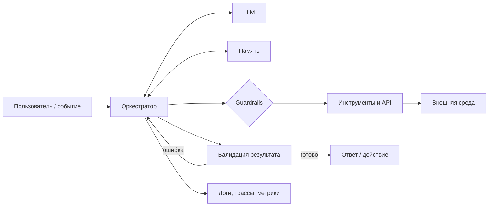

# AI-агент — шаблон проектирования, запуска и масштабирования

Практический шаблон для создания автономного AI-агента: от выбора сценария и проектирования workflow до production-мониторинга и масштабирования.

> [!tip] Интерактивная версия
> [Открыть дашборд «AI Agent Builder»](ai-agent-dashboard/index.html) — 10 этапов, 100 контрольных точек, фильтры и сохранение прогресса.

> Агент — это не только LLM и промпт. Это управляемая система, которая воспринимает контекст, рассуждает, планирует, действует через инструменты и проверяет результат.

Источники идеи:

- [«Полная шпаргалка по Claude» — @abramov_aicreator](https://www.instagram.com/p/DbqYNswMxSz/), 5 августа 2026;
- [«Как создать AI-агента» — @abramov_aicreator](https://www.instagram.com/p/DcM2P76MF46/), 18 августа 2026.

Материалы объединены в заполняемый шаблон, дополнены контрольными точками для production и интерактивным выбором контура реализации.

Связанные материалы: [[Claude — карта возможностей]], [[Claude Code — структура AI-assisted проекта]], [[Harness Engineering — универсальный чек-лист разработки приложений]], [[AI -системы]], [[Graph Engineering для AI-агентов]].

## Паспорт агента

| Поле | Значение |
|---|---|
| Название | `[название]` |
| Владелец | `[команда / человек]` |
| Пользователь | `[роль / сегмент]` |
| Проблема | `[какую работу нужно выполнить]` |
| Цель | `[измеримый результат]` |
| Уровень автономности | `[советует / предлагает действие / действует с подтверждением / действует сам]` |
| Среда | `[локально / облако / корпоративный контур]` |
| Данные | `[источники и класс чувствительности]` |
| Бюджет | `[руб./запрос, токены, время]` |
| Критичность | `[низкая / средняя / высокая]` |
| Человек в цикле | `[где и кто подтверждает]` |
| Kill switch | `[как немедленно остановить агента]` |

## 1. Сценарий и границы

- [ ] Описать задачу одним предложением: «Когда `[событие]`, агент должен `[результат]` для `[пользователь]`».
- [ ] Зафиксировать текущий ручной процесс и его стоимость.
- [ ] Определить входы, выходы и критерии успешного результата.
- [ ] Перечислить ситуации, в которых агент не должен действовать.
- [ ] Выбрать уровень автономности для каждого действия.
- [ ] Указать решения, требующие подтверждения человека.
- [ ] Описать ошибки с высокой ценой и допустимый риск.
- [ ] Сформировать 10–30 реальных примеров для первого eval-набора.
- [ ] Зафиксировать baseline: время, качество и стоимость без агента.
- [ ] Выбрать один узкий MVP-сценарий вместо универсального помощника.

### Карточка сценария

```text
Пользователь:
Триггер:
Входные данные:
Желаемый результат:
Разрешённые действия:
Запрещённые действия:
Когда нужен человек:
Условие успеха:
Условие остановки:
```

## 2. Компоненты агента

- [ ] **Модель:** провайдер, модель, версия, fallback.
- [ ] **Инструкции:** роль, цель, правила, формат ответа, запреты.
- [ ] **Контекст:** какие данные нужны на каждом шаге и откуда они берутся.
- [ ] **Память:** краткосрочная, долговременная, правила записи и забывания.
- [ ] **Планировщик:** как задача разбивается на шаги и когда перепланируется.
- [ ] **Инструменты:** строгие схемы входов/выходов и обработка ошибок.
- [ ] **Guardrails:** валидация, политики, лимиты, фильтры и подтверждения.
- [ ] **Среда:** sandbox, сеть, файловая система, секреты и разрешения.
- [ ] **Наблюдаемость:** трассировка решений, вызовов и затрат.
- [ ] **Evals:** измеримые проверки качества всей системы.

### Архитектура



## 3. Стек и инструменты

Заполнять только теми компонентами, которые действительно нужны MVP.

| Слой | Выбор | Альтернативы | Почему выбран |
|---|---|---|---|
| LLM | `[Claude / OpenAI / Gemini / Llama / другое]` | `[варианты]` | `[качество, цена, latency, контекст]` |
| Оркестрация | `[свой workflow / LangGraph / AutoGen / CrewAI / другое]` | `[варианты]` | `[причина]` |
| Векторный поиск | `[pgvector / Pinecone / Weaviate / Qdrant / Milvus / Chroma]` | `[варианты]` | `[причина]` |
| Память / state | `[PostgreSQL / Redis / MongoDB / другое]` | `[варианты]` | `[причина]` |
| Инструменты | `[Search / CRM / Notion / внутренние API / другое]` | `[варианты]` | `[причина]` |
| Развёртывание | `[Vercel / Railway / Render / Fly.io / AWS / GCP / другое]` | `[варианты]` | `[причина]` |
| Наблюдаемость | `[LangSmith / Phoenix / Helicone / W&B / PromptLayer / Grafana]` | `[варианты]` | `[причина]` |

> Не добавлять фреймворк, векторную БД или многоагентность «на будущее». Каждый компонент должен устранять уже обнаруженное ограничение.

## 4. Проектирование поведения

### Роль и контракт

```text
Ты — [роль агента].

Цель: [измеримая цель].
Пользователь: [для кого работает агент].

Вход:
- [поле и формат]

Доступные инструменты:
- [tool_1]: [когда применять]
- [tool_2]: [когда применять]

Рабочий цикл:
1. Проверь вход и недостающий контекст.
2. Составь минимальный план.
3. Выполни только разрешённые действия.
4. Проверь результат по критериям.
5. Верни ответ в заданном формате.

Ограничения:
- [запрет]
- [лимит]
- [условие подтверждения человеком]

Если данных недостаточно: [уточнить / безопасно остановиться].
Если инструмент завершился ошибкой: [повторить N раз / fallback / передать человеку].
Формат результата: [JSON schema / Markdown / действие + отчёт].
```

### Workflow

1. **Воспринимать:** собрать и проверить данные.
2. **Рассуждать:** понять задачу, риски и ограничения.
3. **Планировать:** выбрать следующие шаги и инструменты.
4. **Действовать:** выполнить один контролируемый шаг.
5. **Наблюдать:** получить фактический результат инструмента.
6. **Проверять:** сравнить с критерием успеха.
7. **Завершить или повторить:** остановиться при успехе, лимите или риске.

### Таблица инструментов

| Инструмент | Назначение | Вход | Выход | Права | Timeout | Retry | Требует подтверждения |
|---|---|---|---|---|---:|---:|---|
| `[название]` | `[действие]` | `[schema]` | `[schema]` | `[read/write]` | `[сек.]` | `[N]` | `[да/нет]` |

## 5. Память и контекст

- [ ] Разделить историю диалога, рабочее состояние и долговременные знания.
- [ ] Определить, что агент вправе запоминать автоматически.
- [ ] Для каждой записи хранить источник, время, владельца и срок жизни.
- [ ] Не сохранять секреты и лишние персональные данные.
- [ ] Проверять актуальность памяти перед использованием.
- [ ] Предусмотреть исправление и удаление неверной памяти.
- [ ] Ограничить объём контекста и применять релевантный поиск.
- [ ] Защититься от инструкций внутри недоверенных документов.
- [ ] Логировать, какие фрагменты памяти повлияли на решение.
- [ ] Тестировать конфликтующие и устаревшие воспоминания.

## 6. Сборка и тестирование

- [ ] Поднять воспроизводимую локальную среду.
- [ ] Подключить модель через один адаптер, пригодный для замены провайдера.
- [ ] Реализовать инструменты с типизированными контрактами.
- [ ] Добавить таймауты, лимиты повторов и обработку частичных сбоев.
- [ ] Валидировать вход и структурированный выход.
- [ ] Написать unit-тесты инструментов и бизнес-правил.
- [ ] Написать интеграционные тесты workflow.
- [ ] Прогнать happy path, edge cases и враждебные входы.
- [ ] Проверить hallucination, prompt injection и утечку данных.
- [ ] Сравнить результат с baseline и критериями MVP.

### Набор evals

| ID | Сценарий | Вход | Ожидаемое поведение | Метрика | Порог | Результат |
|---|---|---|---|---|---|---|
| E-001 | `[название]` | `[fixture]` | `[проверяемый результат]` | `[метрика]` | `[значение]` | `[pass/fail]` |

## 7. Развёртывание

- [ ] Выбрать платформу по требованиям к данным, latency и масштабированию.
- [ ] Контейнеризировать сервис и закрепить версии зависимостей.
- [ ] Хранить секреты в secret manager, а не в коде и промптах.
- [ ] Разделить dev, staging и production.
- [ ] Настроить аутентификацию, авторизацию и rate limits.
- [ ] Подготовить миграции состояния и памяти.
- [ ] Добавить health/readiness checks.
- [ ] Выбрать стратегию rollout: canary, feature flag или поэтапный запуск.
- [ ] Подготовить rollback и kill switch.
- [ ] Провести production-readiness review до включения пользователей.

## 8. Мониторинг

| Группа | Метрики |
|---|---|
| Результат | доля успешных задач, точность, удовлетворённость пользователя |
| Надёжность | ошибки, таймауты, fallback, незавершённые workflow |
| Качество | hallucination rate, доля ручных исправлений, eval pass rate |
| Скорость | end-to-end latency, время модели, время инструментов |
| Стоимость | стоимость задачи, токены, число вызовов, стоимость инструментов |
| Поведение | число шагов, повторные планы, циклы, эскалации человеку |
| Безопасность | заблокированные действия, injection-попытки, нарушения политик |

- [ ] Сохранять версию модели, промпта, workflow и набора evals.
- [ ] Трассировать каждый шаг без раскрытия секретов.
- [ ] Настроить алерты на SLO, бюджет, ошибки и аномальное поведение.
- [ ] Назначить владельца каждого алерта и срок реакции.
- [ ] Организовать обратную связь пользователей и разбор неудач.

## 9. Оптимизация

- [ ] Сначала улучшать критерии, контекст и инструменты, затем менять модель.
- [ ] Уменьшить лишний контекст и дублирующие вызовы.
- [ ] Кэшировать только безопасные и устойчивые результаты.
- [ ] Использовать более дешёвую модель для простых этапов после eval-проверки.
- [ ] Параллелить только независимые вызовы.
- [ ] Сократить число итераций и установить жёсткий предел шагов.
- [ ] Улучшать tool schemas и сообщения об ошибках.
- [ ] Добавить routing/fallback по сложности и риску.
- [ ] Проверять каждую оптимизацию A/B-тестом или eval-набором.
- [ ] Не обменивать безопасность и корректность на снижение стоимости.

## 10. Масштабирование

- [ ] Подтвердить, что узкий агент стабильно проходит SLO.
- [ ] Разделить stateless-обработку и долговременное состояние.
- [ ] Добавить очередь, идемпотентность и контроль повторной доставки.
- [ ] Ввести лимиты пользователя, организации и всей системы.
- [ ] Масштабировать worker-пулы по типам задач.
- [ ] Распределять нагрузку между моделями и провайдерами.
- [ ] Версионировать промпты, инструменты, память и evals.
- [ ] Обеспечить изоляцию клиентов и региональные требования к данным.
- [ ] Переходить к нескольким агентам только при ясных независимых ролях.
- [ ] Регулярно проводить capacity-, chaos- и disaster-recovery-тесты.

## Gate перед production

- [ ] Цель агента и границы ответственности понятны пользователю.
- [ ] Все высокорисковые действия требуют подтверждения.
- [ ] Основной и негативные сценарии проходят evals.
- [ ] Данные, права и хранение согласованы.
- [ ] Стоимость одной задачи и общий бюджет ограничены.
- [ ] Мониторинг, алерты, rollback и kill switch проверены.
- [ ] Есть владелец продукта и владелец инцидентов.
- [ ] Пользователь видит, что взаимодействует с AI.
- [ ] Результаты агента можно объяснить и восстановить по журналу.
- [ ] Production-запуск одобрен ответственным человеком.

## Карточка результата итерации

| Поле | Значение |
|---|---|
| Версия | `[агент / модель / промпт / workflow]` |
| Что изменилось | `[кратко]` |
| Evals | `[пройдено / всего]` |
| Success rate | `[значение]` |
| P95 latency | `[значение]` |
| Стоимость задачи | `[значение]` |
| Ошибки / hallucinations | `[значение]` |
| Остаточные риски | `[перечень]` |
| Решение | `[выпустить / доработать / откатить]` |
| Следующий эксперимент | `[гипотеза и метрика]` |

## Быстрый MVP

- [ ] Один пользователь и один сценарий.
- [ ] Одна модель и не более 2–3 инструментов.
- [ ] Явный контракт входа и выхода.
- [ ] Подтверждение перед внешними изменениями.
- [ ] 10–30 реальных eval-примеров.
- [ ] Лимит шагов, времени и стоимости.
- [ ] Полная трассировка workflow.
- [ ] Ручной review первых production-запусков.
